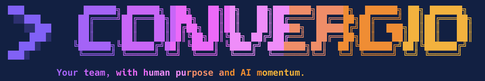
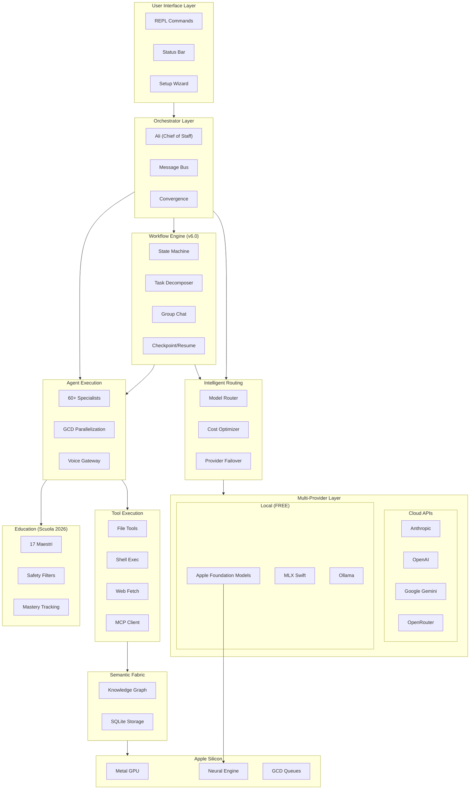

<p align="center">
  
</p>

<h1 align="center">Convergio CLI</h1>

<p align="center">
  <strong>Your Virtual AI Executive Team</strong><br/>
  <em>60+ specialized AI agents. One command. Unlimited expertise.</em>
</p>

<p align="center">
  <a href="https://github.com/Roberdan/convergio-cli/actions/workflows/ci.yml"></a>
  <a href="https://github.com/Roberdan/convergio-cli/releases/latest"></a>
  <a href="https://github.com/Roberdan/convergio-cli/blob/main/LICENSE"></a>
  <a href="https://github.com/Roberdan/convergio-cli"></a>
  <a href="https://github.com/Roberdan/convergio-cli/stargazers"></a>
</p>

<p align="center">
  
  
  
  
  
  
</p>

<p align="center">
  <a href="#-quick-start">Quick Start</a> •
  <a href="#-features">Features</a> •
  <a href="#-anna-executive-assistant">Anna Assistant</a> •
  <a href="#-mlx-local-ai">MLX Local AI</a> •
  <a href="#-documentation">Docs</a>
</p>

---

<h2 align="center">Install in 10 Seconds</h2>

```bash
brew tap Roberdan/convergio-cli && brew install convergio
```

<p align="center">
  <em>Then just run <code>convergio</code> and start talking to Ali!</em>
</p>

---

## The Vision

**Imagine having an entire consulting firm at your fingertips.** Not just one AI assistant — a full team of 60+ specialists who work together, debate ideas, and deliver integrated solutions.

```
┌─────────────────────────────────────────────────────────────────┐
│                         YOU                                      │
│              "Launch a global SaaS platform"                     │
└─────────────────────────────────────────────────────────────────┘
                              │
                              ▼
┌─────────────────────────────────────────────────────────────────┐
│                    ALI (Chief of Staff)                          │
│         Analyzes → Decomposes → Orchestrates → Synthesizes       │
└─────────────────────────────────────────────────────────────────┘
                              │
                              ▼
┌─────────────────────────────────────────────────────────────────┐
│              WORKFLOW ENGINE (v6.0) - DAG Orchestration          │
└─────────────────────────────────────────────────────────────────┘
                              │
══════════════════════════════╪══════════════════════════════════
         PHASE 1: RESEARCH    │  (parallel, checkpoint)
══════════════════════════════╪══════════════════════════════════
        ┌─────────────────────┼─────────────────────┐
        ▼                     ▼                     ▼
   ┌─────────┐          ┌─────────┐          ┌─────────┐
   │ Fiona   │          │ Michael │          │ Sophia  │
   │ Market  │          │   VC    │          │  Gov    │
   └─────────┘          └─────────┘          └─────────┘
        │                     │                     │
        └─────────────────────┴─────────────────────┘
                              │ (dependencies met)
══════════════════════════════╪══════════════════════════════════
         PHASE 2: STRATEGY    │  (conditional branch)
══════════════════════════════╪══════════════════════════════════
                              ▼
                    ┌─────────────────┐
                    │     Domik       │
                    │   Strategy      │──────┐
                    └─────────────────┘      │
                              │              │
              ┌───────────────┴───────┐      │ if budget > $1M
              ▼                       ▼      ▼
        ┌─────────┐             ┌─────────────────┐
        │  Amy    │             │  Wiz + Elena    │
        │  CFO    │             │  Legal Review   │
        └─────────┘             └─────────────────┘
              │                       │
              └───────────┬───────────┘
                          │
══════════════════════════╪══════════════════════════════════
         PHASE 3: BUILD   │  (parallel waves + group chat)
══════════════════════════╪══════════════════════════════════
        ┌─────────────────┼─────────────────┐
        ▼                 ▼                 ▼
   ┌─────────┐      ┌─────────┐      ┌─────────┐
   │ Baccio  │      │ Marco   │      │  Sara   │  ← WAVE 1
   │  Arch   │      │ DevOps  │      │  UX/UI  │
   └─────────┘      └─────────┘      └─────────┘
        │                 │                 │
        ├──────── GROUP CHAT (Debate) ─────┤
        │                 │                 │
        ▼                 ▼                 ▼
   ┌─────────┐      ┌─────────┐      ┌─────────┐
   │  Paolo  │      │   Rex   │      │  Luca   │  ← WAVE 2
   │Standards│      │ Review  │      │Security │
   └─────────┘      └─────────┘      └─────────┘
        │                 │                 │
        └─────────────────┴─────────────────┘
                          │
══════════════════════════╪══════════════════════════════════
         PHASE 4: QA      │  (validation loop)
══════════════════════════╪══════════════════════════════════
                          ▼
                 ┌─────────────────┐
                 │      Thor       │◄────────────┐
                 │  QA Guardian    │             │
                 └─────────────────┘             │
                          │                      │
                    pass? │                      │ fail
                    ┌─────┴─────┐                │
                    ▼           ▼────────────────┘
               [SUCCESS]    [FIX LOOP]
                    │
                    ▼
┌─────────────────────────────────────────────────────────────────┐
│                    CONVERGENCE                                   │
│   Integrated: Strategy + Architecture + Code + Legal + Finance   │
└─────────────────────────────────────────────────────────────────┘
```

**This is not a chatbot. This is a virtual consulting team with workflow orchestration.**

---

## Convergio Editions

Convergio comes in multiple editions, each tailored for specific use cases:

| Edition | Target | AI Agents | Primary Provider |
|---------|--------|-----------|------------------|
| **Master** | Power Users | 60+ specialists | Anthropic/OpenAI/AFM |
| **Developer** | Developers | 60+ specialists | Anthropic/OpenAI/AFM |
| **Business** | SMBs | 60+ specialists | Anthropic/OpenAI |
| **Education** | Schools | 17 Maestri | Azure OpenAI (GDPR) |

### Build Different Editions

```bash
# Master Edition (default)
make EDITION=master

# Education Edition
make EDITION=education

# Developer Edition
make EDITION=developer

# Business Edition
make EDITION=business
```

---

## Education Edition - Convergio Scuola

<p align="center">
  
  
  
</p>

**A safe, educational AI platform for Italian schools.** Convergio Education transforms 60+ business agents into 17 beloved historical teachers ("Maestri") who inspire learning through the Socratic method.

### The 17 Maestri (Teachers)

| Maestro | Subject | Teaching Style |
|---------|---------|----------------|
| **Ali** | Principal (Preside) | Coordinates all Maestri, welcomes students |
| **Euclide** | Mathematics | Patient step-by-step explanations |
| **Feynman** | Physics | Real-world analogies and experiments |
| **Manzoni** | Italian | Gentle grammar correction, literary passion |
| **Darwin** | Natural Sciences | Discovery through observation |
| **Erodoto** | History | Storytelling through ages |
| **Leonardo** | Art & Design | Visual creativity and imagination |
| **Shakespeare** | English | Dramatic language learning |
| **Mozart** | Music | Sound, rhythm, and harmony |
| **Socrate** | Philosophy | Maieutic questioning method |
| **Lovelace** | Computer Science | Accessible programming concepts |
| **Ippocrate** | Health Education | Body-friendly wellness tips |
| **Curie** | Chemistry | Safe experiments and curiosity |
| **Galileo** | Astronomy | Wonder of the cosmos |
| **Jenny** | Accessibility | Inclusive learning support |
| **Goethe** | German | Cultural language immersion |
| **Cervantes** | Spanish | Hispanic literature journey |

### Key Features

**Safety First**
- Content filtering for age-appropriate responses
- Jailbreak protection and prompt injection defense
- Sensitive topic redirection to trusted adults
- No exposure to business/enterprise functionality

**Accessibility**
- Dyslexia-friendly font options
- High contrast mode
- Adjustable line spacing
- ADHD-optimized short responses
- Screen reader compatibility
- Motor impairment support

**Study Tools**
- `/quiz` - Interactive quizzes
- `/flashcards` - Spaced repetition cards
- `/mindmap` - Visual concept mapping
- `/summary` - Smart text summarization
- `/timeline` - Historical timelines
- `/pomodoro` - Focus timer

**Student Progress**
- Libretto (report card) system
- Progress tracking per subject
- Achievement badges
- Study statistics

### GDPR Compliance

Education Edition **exclusively uses Azure OpenAI** for GDPR compliance:

```bash
# Required environment variables
export AZURE_OPENAI_API_KEY="your-key"
export AZURE_OPENAI_ENDPOINT="https://your-region.openai.azure.com/"
export AZURE_OPENAI_DEPLOYMENT="gpt-4o-mini"
```

**No fallback to Anthropic or other providers** - all data stays within EU Azure regions.

### Running Education Tests

```bash
# Run comprehensive test suite (104 tests)
./tests/e2e_education_comprehensive_test.sh

# Run specific section
./tests/e2e_education_comprehensive_test.sh --section 5

# Available sections:
# 0: Azure OpenAI Verification (Critical)
# 1: Edition Identity and Isolation
# 2: Menu and Navigation
# 3: All 17 Maestri Availability
# 4: Study Tools
# 5: Maestri Responses - Pedagogy
# 6: Realistic Lesson Examples
# 7: Accessibility Features
# 8: Safety and Content Filtering
# 9: Ali Preside Behavior
# 10: Cross-Subject Integration
# 11: Student Profile and Progress
```

---

## Coming Soon: Convergio Native for macOS

<p align="center">
  
</p>

We're building a **stunning native macOS application** with Apple's Liquid Glass design language! The CLI will remain fully supported, but soon you'll have a beautiful GUI option.

**Features in development:**
- 🎨 Liquid Glass UI with glass-morphism effects
- 🤖 Real-time Agent Interaction Visualizer
- ⚙️ Full Settings UI (API keys, budgets, MCP servers)
- 📝 Agent Markdown Editor with live preview
- 📚 Comprehensive in-app Help System
- 🔔 Native macOS notifications
- ⌨️ Global hotkey (Cmd+Shift+Space)

**Want to contribute or follow progress?**

```bash
git clone https://github.com/Roberdan/convergio-cli.git
cd convergio-cli/ConvergioApp
xcodegen && open ConvergioApp.xcodeproj
```

---

## Website

Visit our website to learn more about Convergio and compare it to other AI solutions.

**Website Sections:**

- **CLI Features** - Full list of Convergio CLI capabilities
- **Meet Your AI Team** - 60+ specialized agents overview
- **Education Edition** - 17 AI Maestri for students (Socrate, Euclide, Galileo, Leonardo, Einstein, and more)
- **Native App** - Upcoming SwiftUI app with menu bar integration
- **Compare** - Feature comparison vs ChatGPT, Claude, Ollama, LM Studio
- **Technology** - Apple Silicon, MLX, Metal GPU, Apple Foundation Models

**Running the website locally:**

```bash
cd website
python3 -m http.server 8080
# Open http://localhost:8080
```

---

## What's New in v6.0.0

### Multi-Edition Release

Convergio v6.0.0 introduces **four specialized editions**:

| Edition | Binary | Target Users |
|---------|--------|--------------|
| **Master** | `convergio` | Power users, full features |
| **Education** | `convergio-edu` | Schools, students (Scuola 2026) |
| **Business** | `convergio-biz` | Enterprise, teams |
| **Developer** | `convergio-dev` | Debug tools, APIs |

### Apple Foundation Models (AFM)

Native on-device AI for macOS 26+ with Apple Intelligence:

```bash
# AFM automatically used when available
> convergio --provider afm "Explain this code"

# Check AFM availability
> convergio info --providers
```

- Zero API costs with on-device inference
- Privacy-first: data never leaves your Mac
- Graceful fallback to MLX on pre-macOS 26

### Education Edition - Scuola 2026

Complete learning platform for Italian schools:

```bash
# Start education edition
convergio-edu

# Student features
> /study matematica           # Start study session
> /quiz fisica 10            # Generate quiz
> /flashcards storia         # Spaced repetition cards
> /progress                  # View learning progress
```

**Education Features:**
- **FSRS Algorithm**: Optimal spaced repetition scheduling
- **Mastery Tracking**: Skill gap identification and remediation
- **Accessibility**: DSA, ADHD, Autism support with adaptive UI
- **Ali Preside**: School administrator dashboard
- **GDPR Compliant**: Azure OpenAI backend for EU schools
- **15 Maestri AI**: Subject-specific teaching agents

### Voice Gateway

Real-time voice interaction:

```bash
> /voice start              # Start voice mode
> /voice history            # View voice history
```

- OpenAI Realtime API integration
- Azure Realtime for enterprise
- VoiceOver accessibility

See [CHANGELOG.md](CHANGELOG.md) for complete version history.

---

## Plan Database - Persistent Execution Plans

Track and manage multi-step execution plans with SQLite-backed persistent storage.

```bash
# List all execution plans
> /plan list

# Show detailed plan status
> /plan status abc123

# Export plan to Markdown with Mermaid diagrams
> /plan export abc123

# Cleanup old plans
> /plan cleanup 30
```

**Plan Database Features:**
- **ACID transactions** - Thread-safe multi-agent coordination
- **Progress tracking** - Real-time task completion stats
- **Export to Markdown** - With Mermaid Gantt charts
- **Automatic cleanup** - Remove old plans after N days

### Output Service - Structured Document Generation

Generate rich Markdown documents with Mermaid diagrams, tables, and clickable links.

```bash
# List recent outputs
> /output list

# Show most recent output
> /output latest

# Open output in default app
> /output open /path/to/report.md

# Check disk usage
> /output size

# Cleanup old outputs
> /output cleanup 30
```

**Output Service Features:**
- **Mermaid diagrams** - Flowcharts, sequence, Gantt, pie, mindmap
- **Table generation** - Formatted Markdown tables
- **OSC8 hyperlinks** - Clickable file paths in terminal (iTerm2, Warp, Kitty)
- **Auto-organization** - Files sorted by date/project

---

## Anna Executive Assistant - Your AI-Powered Personal Productivity System

Anna is your dedicated executive assistant agent with native task management, smart reminders, and proactive scheduling — all running locally with zero cloud dependencies.

```bash
# Natural language task creation
> /todo add "Review Q4 budget" high due:tomorrow

# Quick reminders with natural language dates
> /remind "Call John about the merger" in 2 hours
> /remind "Quarterly review" next Monday at 9am
> /remind "Dentist appointment" Dec 25 at 10:00

# Smart scheduling (English + Italian)
> /remind "Riunione team" domani alle 15:00
```

**Anna Features:**
- **Native Todo Manager**: Priorities, due dates, subtasks, tags, recurrence (iCal RRULE)
- **Full-Text Search**: FTS5-powered search across all tasks
- **Smart Reminders**: Natural language date parsing in English and Italian
- **Background Daemon**: macOS notifications even when Convergio is closed
- **Inbox System**: Quick capture without immediate processing
- **Statistics**: Daily/weekly completion tracking

### MLX Local AI - 100% Offline, Zero Cost

Run AI models completely offline on your Mac. No API keys, no internet, no costs. Pure Apple Silicon performance.

```bash
# Start with local AI
convergio --local --model llama-3.2-3b

# Or use the setup wizard
> /setup
# Select "Local Models" → Download a model
```

**Available Local Models:**

| Model | Size | RAM | Best For |
|-------|------|-----|----------|
| **Llama 3.2 1B** | 1.5GB | 8GB | Ultra-fast, basic tasks |
| **Llama 3.2 3B** | 3.1GB | 8GB | Balanced (recommended) |
| **DeepSeek R1 1.5B** | 1.2GB | 8GB | Fast reasoning |
| **DeepSeek R1 7B** | 4.5GB | 16GB | Strong reasoning |
| **DeepSeek R1 14B** | 8.5GB | 24GB | Best reasoning |
| **Qwen 2.5 Coder 7B** | 4.5GB | 16GB | Code generation |
| **Mistral 7B Q4** | 4.5GB | 16GB | Multilingual |
| **Llama 3.1 8B Q4** | 5GB | 16GB | Best overall quality |

**Why Local?**
- **Privacy**: Data never leaves your Mac
- **Offline**: Works without internet
- **Free**: Zero API costs forever
- **Fast**: No network latency
- **Optimized**: Metal GPU + Neural Engine acceleration

### MCP Integration - Extensible Tool Ecosystem

Connect to any Model Context Protocol server to extend Convergio's capabilities.

```bash
# List connected MCP servers
> /mcp list

# Connect to a new server
> /mcp connect filesystem

# View available tools
> /mcp tools
```

**MCP Features:**
- **Multi-Transport**: stdio, HTTP POST, Server-Sent Events (SSE)
- **Auto-Discovery**: Automatic tool detection from servers
- **JSON-RPC 2.0**: Full protocol compliance
- **MCP 2025-06-18**: Latest specification support

### Latest AI Models (December 2025)

| Provider | Models | Highlights |
|----------|--------|------------|
| **Anthropic** | Claude Opus 4.5, Claude Sonnet 4.5, Claude Haiku 4.5 | Extended thinking, tool use, vision |
| **OpenAI** | GPT-5.2, GPT-5.2 Pro, o3, o3-mini, o4-mini | Advanced reasoning, multimodal |
| **Google** | Gemini 3.0 Pro, Gemini 3.0 Deep Think, Gemini 2.0 Flash | 2M token context, thinking mode |
| **OpenRouter** | DeepSeek R1, Llama 3.3, Mistral Large 2, Qwen 2.5 | 300+ models, competitive pricing |
| **Ollama** | Any local model | Self-hosted, privacy-first |
| **MLX** | Llama, DeepSeek, Qwen, Mistral | 100% offline Apple Silicon |

### Apple Silicon M5 Support

Full support for the complete Apple Silicon family:

| Chip | Status | Optimization |
|------|--------|--------------|
| **M5 / M5 Pro / M5 Max / M5 Ultra** | Native | Full Neural Engine + Metal 3 |
| **M4 / M4 Pro / M4 Max** | Native | Neural Engine + Metal 3 |
| **M3 / M3 Pro / M3 Max** | Native | Neural Engine + Metal 3 |
| **M2 / M2 Pro / M2 Max / M2 Ultra** | Native | Neural Engine + Metal |
| **M1 / M1 Pro / M1 Max / M1 Ultra** | Native | Neural Engine + Metal |

---

## Features

### Multi-Agent Orchestration

**60+ Specialist Agents** working in parallel, coordinated by Ali:

| Agent | Role | Specialty |
|-------|------|-----------|
| **Ali** | Chief of Staff | Orchestration, synthesis |
| **Domik** | McKinsey Partner | Strategic decisions, ISE prioritization |
| **Amy** | CFO | Financial analysis, ROI modeling |
| **Baccio** | Tech Architect | System design, scalable architecture |
| **Luca** | Security Expert | Cybersecurity, penetration testing |
| **Marco** | DevOps Engineer | CI/CD, Infrastructure as Code |
| **Sara** | UX Designer | User-centered design |
| **Omri** | Data Scientist | ML, predictive modeling, analytics |
| **Sofia** | Marketing Strategist | Growth hacking, brand strategy |
| **Anna** | Executive Assistant | Tasks, reminders, productivity |
| **Rex** | System Design | Architecture patterns |
| **Dario** | DevEx | Developer experience |
| **Otto** | CI/CD Specialist | Pipeline optimization |
| **Paolo** | Backend Architecture | API design, microservices |
| ... | **+40 more** | Legal, HR, Creative, PM, QA, etc. |

### Intelligent Model Routing

Automatically select the best model for each task:

```
Budget > $3.00  →  Claude Opus 4.5 / GPT-5.2 Pro (full capability)
Budget > $1.00  →  Claude Sonnet 4.5 / GPT-5.2 (balanced)
Budget > $0.10  →  Claude Haiku 4.5 / Gemini Flash (fast, cheap)
Budget < $0.10  →  Session paused (user confirmation required)
```

### Semantic Memory & Knowledge Graph

Persistent, interconnected memories that survive restarts:

```bash
# Store memories
> /remember Roberto prefers TypeScript over JavaScript

# Semantic search (by meaning, not keywords)
> /search what languages does Roberto prefer

# View knowledge graph
> /graph

# Delete memories
> /forget 0x12345678
```

### Context Compaction - Unlimited Conversations

Never lose context. Convergio automatically compacts long conversations:

- **Dynamic Thresholds**: Adapts to model context window
- **Intelligent Summarization**: Preserves key information
- **5 Checkpoints**: Restore any previous state
- **Cost Optimized**: Uses economical models for summarization

### Response Styles

Customize how agents respond:

```bash
> /style flash      # Ultra-concise, immediate
> /style concise    # Brief, to-the-point
> /style balanced   # Moderate detail (default)
> /style detailed   # Comprehensive, thorough
```

### Model Comparison & Benchmarking

Compare responses from multiple models:

```bash
# Compare models side-by-side
> /compare "Explain quantum computing"

# Benchmark model performance
> /benchmark claude-sonnet-4-5
```

### Development Tools Integration

```bash
# Auto-detect and run tests
> /test

# Git workflow
> /git status
> /git commit
> /git push

# Create pull request
> /pr "Add new feature"

# Check development tools
> /tools check
> /tools install
```

### Themes & Customization

```bash
# Interactive theme selector
> /theme

# Available themes: default, dark, light, monokai, dracula, nord
```

---

## Quick Start

### Prerequisites

- macOS 14+ (Sonoma or later)
- Apple Silicon (M1/M2/M3/M4/M5)
- Xcode Command Line Tools (for building from source)

### Installation via Homebrew (Recommended)

```bash
# Add the tap (once)
brew tap Roberdan/convergio-cli

# Install Master Edition (default)
brew install convergio
```

### Installation from GitHub Release

Download pre-built binaries for your edition:

| Edition | Download | Description |
|---------|----------|-------------|
| **Master** | [convergio-6.0.1-arm64-apple-darwin.tar.gz](https://github.com/Roberdan/convergio-cli/releases/download/v6.0.1/convergio-6.0.1-arm64-apple-darwin.tar.gz) | Full-featured for power users |
| **Education** | [convergio-edu-6.0.1-arm64-apple-darwin.tar.gz](https://github.com/Roberdan/convergio-cli/releases/download/v6.0.1/convergio-edu-6.0.1-arm64-apple-darwin.tar.gz) | Schools, students (Scuola 2026) |
| **Business** | [convergio-biz-6.0.1-arm64-apple-darwin.tar.gz](https://github.com/Roberdan/convergio-cli/releases/download/v6.0.1/convergio-biz-6.0.1-arm64-apple-darwin.tar.gz) | Enterprise features |
| **Developer** | [convergio-dev-6.0.1-arm64-apple-darwin.tar.gz](https://github.com/Roberdan/convergio-cli/releases/download/v6.0.1/convergio-dev-6.0.1-arm64-apple-darwin.tar.gz) | Debug tools, APIs |

```bash
# Example: Install Education Edition manually
curl -LO https://github.com/Roberdan/convergio-cli/releases/download/v6.0.1/convergio-edu-6.0.1-arm64-apple-darwin.tar.gz
tar -xzf convergio-edu-6.0.1-arm64-apple-darwin.tar.gz
sudo mv convergio-edu /usr/local/bin/

# Run
convergio-edu setup
convergio-edu
```

### Installation from Source

```bash
# Clone
git clone https://github.com/Roberdan/convergio-cli.git
cd convergio-cli

# Build specific edition
make EDITION=master      # Master Edition (default) → build/bin/convergio
make EDITION=education   # Education Edition → build/bin/convergio-edu
make EDITION=business    # Business Edition → build/bin/convergio-biz
make EDITION=developer   # Developer Edition → build/bin/convergio-dev

# Setup (interactive wizard)
./build/bin/convergio setup

# Run
./build/bin/convergio
```

### Configuration

API keys can be configured via:

1. **macOS Keychain** (Recommended): `convergio setup`
2. **Environment variables**:
   ```bash
   export ANTHROPIC_API_KEY=sk-ant-...
   export OPENAI_API_KEY=sk-proj-...
   export GEMINI_API_KEY=AIza...
   export OPENROUTER_API_KEY=sk-or-...
   ```
3. **Config file**: `~/.convergio/config.json`

---

## Editions

Convergio is available in multiple editions, each focused on specific use cases:

| Edition | Agents | Target Audience | Installation |
|---------|--------|-----------------|--------------|
| **Master** | 60+ | Developers, power users | `brew install convergio` |
| **Education** | 18 | Students, teachers | `brew install convergio-edu` |
| **Business** | 10 | SMBs, sales teams | `--edition business` |
| **Developer** | 10 | DevOps, tech leads | `--edition developer` |

### Switching Editions at Runtime

```bash
# Via CLI flag
convergio --edition business

# Via environment variable
export CONVERGIO_EDITION=developer
convergio

# Via config.toml
# Add to ~/.convergio/config.toml:
# [ui]
# edition = "business"
```

**Note:**
- Edition is set at startup and takes effect immediately for that session
- To change edition, start a new Convergio session with the desired flag/config
- Education edition requires a dedicated binary (`convergio-edu`) for child safety compliance

### Building Specific Editions

```bash
make                      # Master (default)
make EDITION=education    # Education (outputs convergio-edu)
make EDITION=business     # Business (outputs convergio-biz)
make EDITION=developer    # Developer (outputs convergio-dev)
```

### Education Pack Features

The Education edition (`convergio-edu`) provides a complete virtual classroom experience:

**15 Historical Maestri (Teachers)**
- Socrate (Philosophy), Euclide (Math), Feynman (Physics), Darwin (Sciences)
- Erodoto (History), Humboldt (Geography), Manzoni (Italian), Shakespeare (English)
- Leonardo (Art), Mozart (Music), Cicerone (Civics), Smith (Economics)
- Lovelace (Computer Science), Ippocrate (Health), Chris (Storytelling)

**Didactic Toolkit**
| Command | Description |
|---------|-------------|
| `/study <subject>` | Start guided study session |
| `/homework <topic>` | Anti-cheat homework helper (Socratic method) |
| `/quiz [subject]` | Generate adaptive quizzes |
| `/flashcards` | SM-2 spaced repetition flashcards |
| `/mindmap <topic>` | Visual concept maps |
| `/define <word>` | Dictionary with etymology |
| `/conjugate <verb>` | Verb conjugation tables |
| `/calc <expression>` | Visual calculator with step-by-step |

**Libretto (Student Gradebook)**
| Command | Description |
|---------|-------------|
| `/libretto` | View grades and progress |
| `/libretto voto <grade>` | Record a new grade |
| `/libretto diario` | Daily activity log |
| `/libretto report` | Progress report for parents |

**Accessibility Support (WCAG 2.1 AA)**
- Dyslexia: OpenDyslexic font, syllabification, cream background
- Dyscalculia: Color-coded numbers, visual place values
- ADHD: Chunked content, progress bars, break reminders
- Autism: Predictable structure, transition warnings
- Motor difficulties: Extended timeouts, large targets

**Child Safety**
- Compile-time locked binary (cannot switch editions at runtime)
- Content filtering for age-appropriate responses
- Prompt injection protection
- No external tool execution

---

## Commands Reference

### Core Commands

| Command | Description |
|---------|-------------|
| `/help [command]` | Interactive help system |
| `/status` | System status and agent info |
| `/quit` | Exit Convergio |

### Agent Management

| Command | Description |
|---------|-------------|
| `/agents` | List all 60+ agents |
| `/agent <name>` | Configure individual agent |
| `/think <query>` | Direct agent thinking mode |

### Anna Executive Assistant

| Command | Description |
|---------|-------------|
| `/todo add <task>` | Create a task |
| `/todo list` | Show all tasks |
| `/todo done <id>` | Complete a task |
| `/todo start <id>` | Start working on a task |
| `/todo delete <id>` | Delete a task |
| `/remind <msg> <when>` | Create a reminder (natural language) |
| `/reminders` | Show upcoming reminders |
| `/daemon start/stop/status` | Manage notification daemon |

### Memory & Knowledge

| Command | Description |
|---------|-------------|
| `/remember <text>` | Store a memory |
| `/search <query>` | Semantic search |
| `/memories` | List recent memories |
| `/forget <id>` | Delete a memory |
| `/graph` | Knowledge graph stats |

### Model & Provider

| Command | Description |
|---------|-------------|
| `/setup` | Interactive configuration wizard |
| `/auth` | Authentication status |
| `/cost` | Show/set budget |
| `/compare` | Compare multiple models |
| `/benchmark` | Test model speed |

### Development Tools

| Command | Description |
|---------|-------------|
| `/test` | Run project tests (auto-detect) |
| `/git <status/commit/push>` | Git workflow |
| `/pr [title]` | Create pull request |
| `/tools <check/install>` | Manage dev tools |

### MCP Integration

| Command | Description |
|---------|-------------|
| `/mcp list` | List MCP servers |
| `/mcp connect <server>` | Connect to server |
| `/mcp tools` | Show available tools |

### Plan Database

| Command | Description |
|---------|-------------|
| `/plan list` | List all execution plans |
| `/plan status <id>` | Show plan details and progress |
| `/plan export <id>` | Export to Markdown with Mermaid |
| `/plan cleanup <days>` | Delete plans older than N days |

### Output Service

| Command | Description |
|---------|-------------|
| `/output list` | Show recent output files |
| `/output latest` | Show most recent output |
| `/output open <path>` | Open file in default app |
| `/output delete <path>` | Remove output file |
| `/output size` | Show disk usage |
| `/output cleanup <days>` | Delete outputs older than N days |

### Workflow Orchestration

| Command | Description |
|---------|-------------|
| `/workflow list` | List available workflows |
| `/workflow show <name>` | Show workflow details |
| `/workflow execute <name> --input <text>` | Execute a workflow |
| `/workflow resume <id>` | Resume a paused workflow |

**Workflow Features:**
- **State Machine Engine**: Complex multi-step agent coordination
- **Checkpointing**: Resume workflows from any point
- **Task Decomposition**: Automatic task breakdown with dependency resolution
- **Group Chat**: Multi-agent discussions with consensus building
- **Conditional Routing**: Dynamic workflow adaptation based on results
- **Error Handling**: Comprehensive retry logic and fallback strategies
- **Observability**: Full logging, telemetry, and security audit trails

**Available Workflow Templates:**
- Code Review & Refinement
- Bug Triage & Fix
- Security Audit
- Performance Optimization
- API Design Review
- Incident Response
- Product Launch
- Pre-Release Checklist (Zero Tolerance Policy)
- Class Council (Education)

See [Workflow Orchestration Documentation](docs/workflow-orchestration/USER_GUIDE.md) for complete details.

### System

| Command | Description |
|---------|-------------|
| `/debug <level>` | Set log level |
| `/stream <on/off>` | Toggle streaming |
| `/theme <name>` | Change theme |
| `/style <style>` | Set response style |
| `/hardware` | Show hardware info |
| `/update` | Check for updates |

---

## Architecture

### System Overview



### Why Convergio vs Others?

| Feature | Convergio | Claude Code | Warp | VSCode + Copilot | Codex CLI |
|---------|-----------|-------------|------|------------------|-----------|
| **Multi-Provider** | 7 providers + AFM | Claude only | Multi | OpenAI only | OpenAI only |
| **Agents** | 60+ specialists | Subagents | Single | Autocomplete | Single |
| **Workflow Engine** | DAG + State Machine | None | None | None | None |
| **Group Chat** | Multi-agent debate | None | None | None | None |
| **Checkpointing** | Resume any point | None | None | None | None |
| **Inter-Agent Comms** | Message Bus | None | None | None | None |
| **Parallel Execution** | GCD native | Batched | Sequential | N/A | Sequential |
| **Convergence** | Automatic | Manual | N/A | N/A | N/A |
| **Per-Agent Models** | Yes | No | No | No | No |
| **Cost Management** | Granular budget | None | Credits | Subscription | API credits |
| **Local AI** | AFM + MLX + Ollama | No | No | No | No |
| **Task Management** | Native (Anna) | No | No | Extensions | No |
| **MCP Support** | Native client | Server | No | No | No |
| **Open Source** | Full | Closed | Partial | Extensions only | Closed |
| **Apple Optimized** | Metal + Neural Engine | Node.js | Rust | Electron | Python |

**Key Differentiators:**

- **vs Claude Code**: Convergio supports 7 providers including AFM (not just Claude), has 60+ real specialist agents (not isolated subagents), automatic convergence, and per-agent model routing
- **vs Warp**: Convergio has true multi-agent orchestration with message bus, not just AI-assisted terminal
- **vs VSCode + Copilot**: Convergio is a full AI orchestration platform, not just code autocomplete. Native task management, semantic memory, and tool execution
- **vs Codex CLI**: Convergio offers multi-agent collaboration, local AI support, and granular cost control

---

## Quality Standards

Convergio maintains rigorous quality standards verified through automated and manual audits:

### Security (PHASE 2 - Verified 2025-12-21)

| Check | Status | Details |
|-------|--------|---------|
| SQL Injection | ✅ PASS | 0 vulnerabilities found |
| Buffer Overflow | ✅ PASS | 0 risks, safe string functions (1219 uses) |
| Command Injection | ✅ PASS | 0 system() vulnerabilities |
| Secrets Management | ✅ PASS | No hardcoded secrets, Keychain recommended |
| CVE Dependencies | ✅ PASS | 0 CVEs, minimal dependencies |
| OWASP Top 10 | ✅ PASS | LOW-MEDIUM risk rating |

### Code Quality (PHASE 3 - Verified 2025-12-21)

| Metric | Status | Details |
|--------|--------|---------|
| Test Coverage | ✅ PASS | 37/37 tests passing |
| Memory Leaks | ✅ PASS | 0 leaks (macOS `leaks` verified) |
| Code Duplication | ✅ PASS | 1.31% (33 clones, acceptable threshold) |
| Naming Conventions | ✅ PASS | Consistent snake_case |
| Error Handling | ✅ PASS | Patterns verified |
| Signal Handlers | ✅ PASS | Graceful shutdown implemented |

### Pre-Release Checklist

Before every release, the following gates must pass:

1. **Security Audit**: All SEC-01 through SEC-04 checks
2. **Quality Gates**: All QA-01 through QA-12 checks
3. **Documentation**: README, CHANGELOG, --help verified
4. **Tests**: Unit, integration, and E2E tests passing
5. **Memory**: Zero leaks on macOS ARM64

See [Workflow Orchestration Plan](docs/plans/WORKFLOW_MERGE_PLAN.md) for detailed audit results.

---

## Technical Specifications

### Performance

| Metric | Value |
|--------|-------|
| Source Files | 86+ C/Objective-C/Swift |
| Lines of Code | ~86,000 LOC |
| Workflow Engine | 12 workflow modules |
| AI Agents | 60+ specialists |
| Providers | 7 (Cloud + Local + AFM) |
| Commands | 45+ REPL commands |
| Tools | 15+ execution tools |
| Models Supported | 300+ across providers |
| Local Models | 8 MLX models |
| Test Coverage | 350+ tests passing |

### Apple Silicon Optimizations

- **Metal GPU**: Hardware-accelerated compute shaders
- **Neural Engine**: MLX model inference
- **GCD**: Optimal thread scheduling (P-cores + E-cores)
- **Unified Memory**: Zero-copy CPU/GPU data sharing
- **Accelerate**: BLAS optimizations for matrix operations

---

## Documentation

- [Provider Setup Guide](docs/PROVIDERS.md)
- [Model Selection Guide](docs/MODEL_SELECTION.md)
- [Cost Optimization](docs/COST_OPTIMIZATION.md)
- [Agent Development](docs/AGENT_DEVELOPMENT.md)
- [MCP Integration](docs/MCP_INTEGRATION.md)
- [Troubleshooting](docs/TROUBLESHOOTING.md)

---

## Development

### Building

```bash
# Clean build
make clean && make

# Debug build
make DEBUG=1

# Run tests
make test
```

### Testing

```bash
make unit_test        # Unit tests
make e2e_test         # End-to-end tests (requires API keys)
make fuzz_test        # Security fuzzing
make compaction_test  # Context compaction
make compare_test     # Model comparison
```

**Testing Strategy:**

| Test Type | CI (GitHub) | Local | Notes |
|-----------|-------------|-------|-------|
| Unit Tests | Required | Yes | Core functionality |
| Sanitizer Tests | Required | Yes | Memory & UB detection |
| Lint & Static Analysis | Required | Yes | Code quality |
| Fuzz Tests | Yes | Yes | Security testing |
| **E2E Tests** | **No** | **Always** | Requires API keys |

**Why E2E tests run only locally:**

E2E tests require real API keys (Anthropic, OpenAI, etc.) to test AI interactions, tool execution, and agent communication. For security and cost reasons, we run them locally before every release, not in CI.

**Local E2E testing is mandatory before release:**

Before every release, E2E tests are run locally using the `app-release-manager` agent or manually:

```bash
# Run full E2E suite locally
./tests/e2e_test.sh

# Or via release manager (includes all quality gates)
convergio
> @app-release-manager prepare release
```

This ensures all features are tested with real AI providers while keeping API keys secure.

---

## Contributing

Contributions are welcome! Please see [CONTRIBUTING.md](CONTRIBUTING.md) for guidelines.

---

## Legal

- [Terms of Service](TERMS_OF_SERVICE.md)
- [Privacy Policy](PRIVACY_POLICY.md)
- [Disclaimer](docs/DISCLAIMER.md)

---

## License

MIT License - see [LICENSE](LICENSE) for details.

---

## Acknowledgments

- [FightTheStroke.org](https://fightthestroke.org) - Supporting the project
- Anthropic, OpenAI, Google - LLM providers
- Apple's MLX framework - Local ML on Apple Silicon

---

<p align="center">
  <strong>Convergio CLI v6.0.1</strong><br/>
  <em>Multi-Model AI Orchestration for Apple Silicon</em>
</p>

<p align="center">
  Developed by <a href="mailto:Roberdan@FightTheStroke.org">Roberto D'Angelo</a> with AI assistance
</p>

<p align="center">
  <strong>Built with ❤️ for Mario by the Convergio Team</strong><br/>
  <em>Making AI work for humans, not the other way around.</em>
</p>
