<p align="center">
  
</p>

# Convergio CLI

> **Multi-Model AI Orchestration for Apple Silicon** - The first CLI that lets you mix Claude, GPT, and Gemini models with intelligent routing, cost optimization, and per-agent model selection.

A semantic kernel for human-AI symbiosis, built natively for Apple Silicon.

**Developed by [Roberto D'Angelo](mailto:Roberdan@FightTheStroke.org) @ [FightTheStroke.org](https://fightthestroke.org)**

## What's New in v3.0

- **Multi-Provider Support**: Use Anthropic, OpenAI, and Google Gemini in the same session
- **Intelligent Model Routing**: Automatically select the best model for each task
- **Per-Agent Model Selection**: Assign different models to different agents
- **Budget-Aware Downgrading**: Automatically switch to cheaper models when budget runs low
- **Provider Failover**: Automatic fallback when one provider is unavailable
- **Real-Time Cost Tracking**: See exactly how much each query costs across providers
- **Status Bar**: Live display of tokens, costs, and active model

## Overview

Convergio CLI is a **multi-agent orchestration system** built in pure C/Objective-C, designed as the foundation for intelligent human-AI collaboration. Unlike typical CLI wrappers around LLM APIs, Convergio implements a complete agent architecture with:

- **Ali** - A Chief of Staff agent that serves as your single point of contact
- **49 specialist agents** that can be spawned on-demand for specific tasks
- **Multi-provider support** - Mix Claude, GPT, and Gemini models seamlessly
- **Intelligent model routing** - Best model for each task, budget-aware
- **Parallel multi-agent orchestration** - Ali can delegate to multiple agents simultaneously
- **Real-time agent status tracking** - See which agents are working and on what
- **Inter-agent communication** - Agents can communicate and collaborate during execution
- **Tool execution** - Ali can read/write files, execute shell commands, fetch web content
- **Notes & Knowledge base** - Persistent markdown notes and searchable knowledge storage
- **Cost control** with granular budget tracking and per-agent attribution
- **Conversation memory** - Persistent memory across sessions with context loading
- **Local embeddings** via pure Metal/C transformer (infrastructure ready, needs weights)

## Why Convergio?

**For Developers:**
- **No vendor lock-in** - Switch providers without code changes
- **Cost control** - Set budgets, track spending per agent, auto-downgrade when needed
- **Resilience** - Automatic failover if one provider is down or rate-limited
- **Best tool for each job** - Use Claude for coding, GPT for multimodal, Gemini for long context

**For Teams:**
- **Predictable costs** - Hard budget limits prevent surprise bills
- **Audit trail** - Full logging of which model handled what task
- **Native performance** - Pure C, no runtime dependencies, Apple Silicon optimized

## Why Not Just Use Claude Code or Warp?

Tools like **Claude Code** and **Warp Terminal** offer excellent AI-assisted development. Here's why Convergio is different:

### The Team Collaboration Model

Convergio's core differentiator is **true multi-agent team orchestration**:

```
USER INPUT
    │
    ▼
┌─────────────────────────────────────────────┐
│         ALI (Chief of Staff)                │
│   Analyzes → Decides who to delegate        │
└─────────────────────────────────────────────┘
    │
    │ GCD dispatch_group_async (parallel)
    ▼
┌────────┬────────┬────────┬────────┐
│ Marco  │ Baccio │ Luca   │ Sara   │  ← PARALLEL
│ (Code) │ (Arch) │ (Sec)  │(Write) │
└───┬────┴───┬────┴───┬────┴───┬────┘
    │        │        │        │
    └────────┴────────┴────────┘
                 │
                 ▼
┌─────────────────────────────────────────────┐
│           MESSAGE BUS                        │
│  • Inter-agent routing                      │
│  • Conversation history                     │
│  • Event callbacks                          │
└─────────────────────────────────────────────┘
                 │
                 ▼
┌─────────────────────────────────────────────┐
│     CONVERGENCE (Ali synthesizes)           │
│  Integrates all perspectives into           │
│  a unified, comprehensive response          │
└─────────────────────────────────────────────┘
```

### Feature Comparison

| Feature | Convergio | Claude Code | Warp |
|---------|-----------|-------------|------|
| **Multi-Provider** | ✅ Native (Claude, GPT, Gemini) | ❌ Claude only | ✅ Native |
| **Team Orchestration** | ✅ Ali + 49 specialists | ⚠️ Isolated subagents | ⚠️ Single agent |
| **Inter-Agent Communication** | ✅ Message Bus | ❌ None | ❌ None |
| **Parallel Execution** | ✅ GCD native | ⚠️ Max ~10, batched | ❌ Sequential |
| **Convergence/Synthesis** | ✅ Automatic | ❌ Manual | ❌ N/A |
| **Per-Agent Model Mapping** | ✅ Marco→GPT, Luca→o1 | ❌ Same for all | ❌ N/A |
| **Cost Management** | ✅ Granular, budget caps, auto-downgrade | ❌ None | ⚠️ Credits only |
| **Agent State Tracking** | ✅ THINKING, IDLE, COLLABORATING | ❌ None | ❌ None |
| **Open Source** | ✅ Full | ❌ Closed | ⚠️ Partial |
| **Apple Silicon Optimized** | ✅ NEON, Metal, GCD | ❌ Node.js | ❌ Rust/generic |

### What's Missing in Claude Code

- **Single provider lock-in** - Only Claude models, no GPT or Gemini
- **No cost management** - No budget caps, no tracking, no auto-downgrade
- **Isolated subagents** - Subagents don't communicate with each other
- **No convergence** - You must manually synthesize multiple agent outputs
- **No model routing** - Can't assign different models to different tasks

### What's Missing in Warp

- **Single agent model** - Agent Mode is one agent with tools, not a team
- **No inter-agent communication** - No message bus
- **Limited cost control** - Credits system, no granular per-agent tracking
- **Closed source core** - Limited customization of routing logic

### When to Use What

| Use Case | Best Tool |
|----------|-----------|
| Quick Claude interactions | Claude Code |
| Modern terminal with AI | Warp |
| **Multi-model orchestration** | **Convergio** |
| **Team-based task delegation** | **Convergio** |
| **Cost-controlled sessions** | **Convergio** |
| **Parallel specialist agents** | **Convergio** |

## Supported Providers & Models

| Provider | Models (examples) | Best For | Pricing (indicative) |
|----------|--------------------|----------|---------------------|
| **Anthropic** | Claude Opus 4, Claude Sonnet 4 | Complex reasoning, coding, agents | Varies by plan |
| **OpenAI** | GPT-4o, o1, GPT-4o-mini | Coding, reasoning, multimodal | See provider docs |
| **Google** | Gemini 1.5 Pro, Gemini 1.5 Flash | Long context, cost-effective | See provider docs |

## Quick Start

### Prerequisites

- macOS 14+ (Sonoma)
- Apple Silicon (M1/M2/M3/M4) - auto-detected at runtime
- Xcode Command Line Tools (for building from source)

### Installation via Homebrew (Recommended)

```bash
brew tap Roberdan/convergio-cli
brew install convergio
```

### Installation from Source

1. **Clone the repository**
   ```bash
   git clone https://github.com/Roberdan/convergio-cli.git
   cd convergio-cli
   ```

2. **Build the project**
   ```bash
   make
   ```

3. **Run setup wizard**
   ```bash
   ./build/bin/convergio setup
   ```
   This will configure your API keys and store them securely in macOS Keychain.

4. **Run Convergio**
   ```bash
   ./build/bin/convergio
   ```

### Configuration

API keys can be configured in multiple ways (in order of priority):

1. **macOS Keychain** (Recommended): Run `convergio setup`
2. **Environment variables**:
   ```bash
   export ANTHROPIC_API_KEY=sk-ant-...
   export OPENAI_API_KEY=sk-proj-...
   export GEMINI_API_KEY=AIza...
   ```
3. **Config file**: `~/.convergio/config.json`

**Claude Max Subscription**: If you have a Claude Max subscription ($20/month), set:
```bash
export CLAUDE_MAX=true
```

## Usage Examples

### Basic Chat
```bash
convergio "What is the capital of France?"
```

### Specify a Provider
```bash
convergio --provider openai "Generate a poem"
convergio --provider anthropic "Review this code"
convergio --provider gemini "Analyze this document"
```

### Specify a Model
```bash
convergio --model claude-opus-4 "Complex reasoning task"
convergio --model gpt-4o "Analyze this code"
convergio --model gemini-1.5-pro "Summarize these documents"
```

### Budget-Limited Session
```bash
convergio --budget 2.00 "Start a session with $2 limit"
```

### Interactive REPL
```bash
convergio
> Hello Ali, can you help me with a coding task?
Ali: Of course! What would you like to work on?
> cost
Session: $0.0032 spent | $4.9968 remaining (using Claude Sonnet 4)
```

## Command Line Options

```bash
convergio [OPTIONS] [COMMAND]

Commands:
  setup                    Configure API keys and settings
  update [check|install]   Check for or install updates
  providers test           Test all configured providers
  providers status         Show provider status
  models list              List available models
  cost status              Show current spending
  cost agents              Show per-agent costs

Options:
  -p, --provider <name>    Use specific provider (anthropic, openai, gemini)
  -m, --model <id>         Use specific model
  -b, --budget <USD>       Set session budget limit
  -a, --agent <name>       Use specific agent
  -w, --workspace <path>   Set workspace directory
  -d, --debug              Enable debug logging
  -t, --trace              Enable trace logging
  -q, --quiet              Disable all logging
  --stream                 Enable streaming output
  --no-status              Disable status bar
  -v, --version            Show version
  -h, --help               Show help message
```

## REPL Commands

| Command | Description |
|---------|-------------|
| `help` | Show available commands |
| `agents` | List all available agents |
| `providers status` | Show provider status |
| `providers test` | Test provider connectivity |
| `models list` | List available models |
| `status` | Show system status |
| `cost` | Show current spending |
| `cost report` | Detailed cost report |
| `cost agents` | Per-agent cost breakdown |
| `cost set <USD>` | Set budget limit |
| `cost reset` | Reset session spending |
| `debug` | Toggle debug mode |
| `quit` | Exit Convergio |

## Agent-Model Mapping

Different agents can use different models optimized for their tasks:

| Agent | Default Model | Fallback | Use Case |
|-------|--------------|----------|----------|
| **Ali** (Chief of Staff) | Claude Opus 4 | GPT-4o | Coordination, synthesis |
| **Marco** (Coder) | Claude Sonnet 4 | GPT-4o | Code generation |
| **Baccio** (Architect) | Claude Opus 4 | GPT-4o | System design |
| **Luca** (Security) | o1 | Claude Opus 4 | Security analysis |
| **Nina** (Analyst) | Gemini 1.5 Pro | GPT-4o | Data analysis (2M context) |
| **Thor** (Reviewer) | GPT-4o-mini | Gemini 1.5 Flash | Fast reviews |
| **Router** | GPT-4o-mini | Gemini 1.5 Flash | Fast routing decisions |

## Cost Optimization

Convergio automatically optimizes costs:

1. **Smart Model Selection**: Uses cheaper models for simple tasks
2. **Prompt Caching**: Reduces costs by up to 90% for repeated queries
3. **Budget Enforcement**: Prevents overspending with hard limits
4. **Downgrade Strategy**: Automatically switches to cheaper models when budget runs low

Example budget progression:
```
Budget > $3.00 → Claude Opus 4 / GPT-4o (full capability)
Budget > $1.00 → Claude Sonnet 4 / GPT-4o (balanced)
Budget > $0.10 → GPT-4o-mini / Gemini 1.5 Flash (fast, cheap)
Budget < $0.10 → Session paused (user confirmation required)
```

## Tools Available to Ali

Ali can interact with the real world using these tools:

| Tool | Description | Safety |
|------|-------------|--------|
| `file_read` | Read file contents | System paths blocked |
| `file_write` | Write/append to files | System paths blocked |
| `file_list` | List directory contents | System paths blocked |
| `shell_exec` | Execute shell commands | Dangerous commands blocked |
| `web_fetch` | Fetch URL content | Standard HTTP/HTTPS |
| `memory_store` | Store info for later retrieval | SQLite + local embeddings |
| `memory_search` | Semantic search (RAG) | Cosine similarity |
| `note_write` | Create/update markdown notes | Stored in data/notes/ |
| `note_read` | Read note contents | - |
| `note_list` | List all available notes | - |
| `knowledge_add` | Add to knowledge base | Stored in data/knowledge/ |
| `knowledge_search` | Search knowledge base | Keyword matching |

## Architecture

### System Overview


### Request Flow


### Budget-Aware Model Selection

```mermaid
flowchart LR
    Budget["Current Budget"] --> Check{Budget Level?}

    Check -->|"> $3.00"| Premium["Premium Models<br/>Claude Opus 4<br/>GPT-4o"]
    Check -->|"> $1.00"| Balanced["Balanced Models<br/>Claude Sonnet 4<br/>GPT-4o"]
    Check -->|"> $0.10"| Fast["Fast/Cheap Models<br/>GPT-4o-mini<br/>Gemini 1.5 Flash"]
    Check -->|"< $0.10"| Pause["⚠️ Session Paused<br/>Confirmation Required"]

    Premium --> Execute["Execute Query"]
    Balanced --> Execute
    Fast --> Execute
    Pause --> Confirm{"User Confirms?"}
    Confirm -->|Yes| AddBudget["Add Budget"]
    Confirm -->|No| End["End Session"]
    AddBudget --> Check
```



### Component Relationships


### Data Flow Summary

| Layer | Components | Responsibility |
|-------|------------|----------------|
| **UI** | REPL, Status Bar, Terminal | User interaction, display |
| **Orchestrator** | Ali, Planning, Cost Control | Task coordination, resource management |
| **Router** | Model Router, Cost Optimizer | Intelligent model selection, failover |
| **Providers** | Anthropic, OpenAI, Gemini adapters | API communication, streaming |
| **Agents** | 49 specialists + Agent Pool | Specialized task execution |
| **Tools** | File, Shell, Web, Memory | External interactions |
| **Fabric** | Semantic Graph, NEON SIMD | Vector search, embeddings |
| **Silicon** | Metal GPU, GCD, Keychain | Hardware acceleration, security |

## How is this different from Claude CLI?

| Feature | Claude CLI | Convergio CLI |
|---------|------------|------------------|
| **Providers** | Anthropic only | Anthropic + OpenAI + Gemini |
| **Model Selection** | Single model | Per-agent model routing |
| **Architecture** | Single LLM wrapper | Multi-agent orchestration |
| **Language** | TypeScript/Node.js | Pure C/Objective-C |
| **Agent Model** | Single assistant | 49 specialist agents + Ali coordinator |
| **Parallel Execution** | N/A | GCD-based parallel agent delegation |
| **Cost Control** | Basic | Granular budget caps, per-agent tracking |
| **Provider Failover** | N/A | Automatic fallback chains |
| **Hardware** | Generic | Apple Silicon optimized |

## Apple Silicon Optimizations

Convergio CLI is specifically optimized for Apple Silicon with:

- **NEON SIMD**: Vectorized operations for embedding similarity search
- **Metal GPU Shaders**: Hardware-accelerated compute for neural operations
- **Accelerate Framework**: BLAS optimizations for matrix operations
- **GCD (Grand Central Dispatch)**: Optimal thread scheduling across P-cores and E-cores
- **Unified Memory**: Zero-copy data sharing between CPU and GPU

## Project Structure

```
convergio-cli/
├── include/nous/          # Public headers
│   ├── nous.h            # Core semantic fabric
│   ├── provider.h        # Provider abstraction
│   ├── orchestrator.h    # Multi-agent orchestration
│   └── tools.h           # Tool execution
├── src/
│   ├── core/             # Main entry point, fabric
│   ├── providers/        # Provider adapters (anthropic, openai, gemini)
│   ├── router/           # Model routing, cost optimization
│   ├── orchestrator/     # Ali, cost, registry, msgbus
│   ├── neural/           # Claude API, MLX embeddings
│   ├── memory/           # SQLite persistence + RAG
│   ├── tools/            # Tool execution (file, shell, web)
│   ├── agents/           # Agent definitions (49 specialists)
│   ├── sync/             # File locking, synchronization
│   ├── ui/               # Status bar, hyperlinks, terminal
│   └── metal/            # GPU compute
├── config/               # Model configurations
├── shaders/              # Metal compute shaders
├── docs/                 # Documentation
├── tests/                # Unit tests
├── data/                 # Runtime data (SQLite, notes, knowledge)
└── README.md             # This file
```

## Documentation

- [Provider Setup Guide](docs/PROVIDERS.md) - Configure Anthropic, OpenAI, Gemini
- [Model Selection Guide](docs/MODEL_SELECTION.md) - Per-agent model configuration
- [Cost Optimization](docs/COST_OPTIMIZATION.md) - Budget management strategies
- [Agent Development](docs/AGENT_DEVELOPMENT.md) - Create custom agents
- [Migration Guide](docs/MIGRATION_v3.md) - Upgrade from v2.x
- [Troubleshooting](docs/TROUBLESHOOTING.md) - Common issues and solutions

## Development

### Building from Source

```bash
# Clean build
make clean && make

# Build with debug symbols
make DEBUG=1

# Run tests
make test
```

### Debug Logging

Enable debug logging to see what's happening under the hood:

```bash
# Via command line
./build/bin/convergio --debug

# Or at runtime
convergio> debug trace
```

## Roadmap

- [x] Multi-provider support (Anthropic, OpenAI, Gemini)
- [x] Intelligent model routing
- [x] Per-agent model selection
- [x] Budget-aware cost optimization
- [x] Provider failover chains
- [x] Status bar with live metrics
- [ ] Pre-trained embedding weights for semantic search
- [ ] Voice input/output support
- [ ] Plugin system for custom tools
- [ ] Web UI interface

## Contributing

Contributions are welcome! Please feel free to submit a Pull Request.

- See `AGENTS.md` for repository guidelines
- Read `CONTRIBUTING.md` for contribution flow

## Legal

- [Terms of Service](TERMS_OF_SERVICE.md)
- [Privacy Policy](PRIVACY_POLICY.md)
- [Disclaimer](docs/DISCLAIMER.md)

## License

MIT License - see [LICENSE](LICENSE) for details.

## Acknowledgments

- [FightTheStroke.org](https://fightthestroke.org) - Supporting the project
- Anthropic, OpenAI, Google - LLM providers
- Apple's MLX framework - Inspiration for local ML on Apple Silicon

---

*Convergio CLI v3.0.13 - Multi-Model AI Orchestration for Apple Silicon*

*Developed by Roberto D'Angelo with AI assistance*
