# Agent Development Guide

This guide explains how to create, configure, and customize agents in Convergio.

## Overview

Agents in Convergio are specialized AI personalities that handle specific types of tasks. Each agent has:
- A unique name and role
- Configured model and provider
- Custom system prompt
- Specific capabilities and limitations

---

## Agent Architecture: Two Types of Agents

Convergio supports **two types of agents** with different purposes and lifecycles:

```
┌─────────────────────────────────────────────────────────────────────────────┐
│                         CONVERGIO AGENT ARCHITECTURE                         │
└─────────────────────────────────────────────────────────────────────────────┘

┌─────────────────────────────────┐    ┌─────────────────────────────────────┐
│      EMBEDDED AGENTS (Core)     │    │       CUSTOM AGENTS (User)          │
├─────────────────────────────────┤    ├─────────────────────────────────────┤
│ Location:                       │    │ Location:                           │
│   src/agents/definitions/*.md   │    │   ~/.convergio/agents/*.json        │
│                                 │    │                                     │
│ Format: Markdown + YAML         │    │ Format: JSON                        │
│                                 │    │                                     │
│ When loaded: Build time         │    │ When loaded: Runtime                │
│   (compiled into binary)        │    │   (hot-reload supported)            │
│                                 │    │                                     │
│ Who creates: Convergio devs     │    │ Who creates: End users              │
│                                 │    │                                     │
│ Count: 53 agents                │    │ Count: Unlimited                    │
│                                 │    │                                     │
│ Modify: Edit .md → make         │    │ Modify: Edit .json → agent reload   │
└─────────────────────────────────┘    └─────────────────────────────────────┘
                │                                      │
                │                                      │
                ▼                                      ▼
┌─────────────────────────────────────────────────────────────────────────────┐
│                           CONVERGIO RUNTIME                                  │
│                                                                             │
│   At startup:                                                               │
│   1. Load embedded agents from EMBEDDED_AGENTS[] array (instant, in-memory) │
│   2. Scan ~/.convergio/agents/ for custom JSON files (file I/O)             │
│   3. Merge both into unified agent registry                                 │
│                                                                             │
│   Custom agents can override embedded agents by using the same name         │
└─────────────────────────────────────────────────────────────────────────────┘
```

### Interactive Diagram (Mermaid)


### Complete Agent Lifecycle (Sequence Diagram)

```mermaid
sequenceDiagram
    autonumber
    participant Dev as 👨‍💻 Developer
    participant MD as 📄 .md files
    participant Script as ⚙️ embed_agents.sh
    participant C as 📦 embedded_agents.c
    participant Make as 🔨 make
    participant Bin as 🎯 convergio
    participant User as 👤 User
    participant Reg as 📋 Registry
    participant API as ☁️ LLM API

    Note over Dev,C: BUILD TIME (Embedded Agents)
    Dev->>MD: Create/edit agent.md
    Dev->>Make: make
    Make->>Script: Run embedding
    Script->>MD: Read all .md files
    Script->>C: Generate C code
    Make->>Bin: Compile binary

    Note over Bin,API: RUNTIME
    User->>Bin: ./convergio
    Bin->>Reg: Load EMBEDDED_AGENTS[]
    Bin->>Reg: Scan ~/.convergio/agents/*.json
    Reg->>Reg: Merge (custom wins)

    User->>Bin: @rex review this code
    Bin->>Reg: lookup("rex")
    Reg->>Bin: AgentInstance
    Bin->>API: POST /chat (system_prompt)
    API->>Bin: Response
    Bin->>User: Display answer

    Note over User,Reg: HOT RELOAD (Custom Agents)
    User->>Bin: agent reload
    Bin->>Reg: Re-scan ~/.convergio/agents/
    Reg->>Reg: Update registry
```



### When to Use Which?

| Scenario | Use Embedded | Use Custom |
|----------|--------------|------------|
| Adding a new core specialist to Convergio | ✅ | |
| Creating a personal assistant for your workflow | | ✅ |
| Contributing to the Convergio project | ✅ | |
| Experimenting with agent configurations | | ✅ |
| Customizing an existing agent's behavior | | ✅ (override) |
| Production deployment with fixed agents | ✅ | |

### Key Differences

| Aspect | Embedded Agents | Custom Agents |
|--------|-----------------|---------------|
| **Performance** | Instant (in-memory) | Fast (file read at startup) |
| **Distribution** | Part of binary | Separate files |
| **Modification** | Requires rebuild | Hot-reload with `agent reload` |
| **Security** | Immutable at runtime | User-editable |
| **Portability** | Automatic | Must copy ~/.convergio/agents/ |

---

## Embedded Agents (For Convergio Developers)

Embedded agents are the **53 core specialists** that ship with Convergio. They are compiled directly into the binary for maximum performance and reliability.

### How Embedding Works

```
┌─────────────────────────────────────────────────────────────────────────────┐
│                         EMBEDDING PROCESS (Build Time)                       │
└─────────────────────────────────────────────────────────────────────────────┘

Step 1: WRITE AGENT DEFINITION
┌─────────────────────────────────────────┐
│ src/agents/definitions/rex-code-        │
│ reviewer.md                             │
│                                         │
│ ---                                     │
│ name: rex-code-reviewer                 │
│ description: Elite Code Reviewer...     │
│ tools: ["Read", "Glob", "Grep"]         │
│ color: "#9B59B6"                        │
│ ---                                     │
│                                         │
│ You are **Rex** — an elite Code         │
│ Reviewer specializing in...             │
└─────────────────────────────────────────┘
                    │
                    ▼
Step 2: RUN EMBEDDING SCRIPT
┌─────────────────────────────────────────┐
│ $ make                                  │
│   └── scripts/embed_agents.sh           │
│                                         │
│ The script:                             │
│ 1. Reads all .md files                  │
│ 2. Escapes special characters           │
│ 3. Generates C string literals          │
│ 4. Creates EMBEDDED_AGENTS[] array      │
└─────────────────────────────────────────┘
                    │
                    ▼
Step 3: GENERATED C FILE
┌─────────────────────────────────────────┐
│ src/agents/embedded_agents.c            │
│                                         │
│ // Auto-generated - DO NOT EDIT         │
│                                         │
│ static const char agent_rex_code_       │
│ reviewer_md[] =                         │
│   "---\n"                               │
│   "name: rex-code-reviewer\n"           │
│   "description: Elite Code...\n"        │
│   ...                                   │
│                                         │
│ const EmbeddedAgent EMBEDDED_AGENTS[] = │
│ {                                       │
│   {"rex-code-reviewer.md",              │
│    agent_rex_code_reviewer_md,          │
│    sizeof(agent_rex_code_reviewer_md)}, │
│   ...                                   │
│ };                                      │
│                                         │
│ const size_t EMBEDDED_AGENTS_COUNT = 54;│
└─────────────────────────────────────────┘
                    │
                    ▼
Step 4: COMPILE INTO BINARY
┌─────────────────────────────────────────┐
│ $ make                                  │
│   └── gcc ... embedded_agents.c ...     │
│                                         │
│ Result: convergio binary contains       │
│ all agent definitions as static         │
│ strings in the DATA segment             │
│                                         │
│ Benefits:                               │
│ - Zero file I/O at runtime              │
│ - No missing file errors                │
│ - Tamper-proof agents                   │
│ - Single-file distribution              │
└─────────────────────────────────────────┘
```

### Adding a New Embedded Agent

1. **Create the agent definition file:**
   ```bash
   # Use kebab-case: firstname-role-description.md
   touch src/agents/definitions/alex-security-auditor.md
   ```

2. **Write the agent definition:**
   ```markdown
   ---
   name: alex-security-auditor
   description: Security auditor specializing in vulnerability assessment
   tools: ["Read", "Glob", "Grep", "Bash", "WebSearch"]
   color: "#E74C3C"
   ---

   <!--
   Copyright (c) 2025 Convergio.io
   Licensed under Creative Commons Attribution-NonCommercial-ShareAlike 4.0
   Part of the MyConvergio Claude Code Subagents Suite
   -->

   You are **Alex** — an elite Security Auditor specializing in...

   ## Security & Ethics Framework
   - **Role Adherence**: I strictly maintain focus on security auditing...
   ...
   ```

3. **Regenerate embedded agents:**
   ```bash
   make
   # This automatically runs scripts/embed_agents.sh
   ```

4. **Verify the agent was added:**
   ```bash
   ./build/bin/convergio agents | grep alex
   ```

5. **Update documentation:**
   - Add the agent to Ali's tier list in `ali-chief-of-staff.md`
   - Update agent count in README.md, CHANGELOG.md, commands.c
   - Add RACI matrix entries if applicable

### Embedded Agent File Format

```yaml
---
# YAML Frontmatter (required)
name: agent-name              # Unique identifier, kebab-case
description: Short description # One-line summary
tools: ["Tool1", "Tool2"]     # Available tools (see Tools section)
color: "#HEX"                 # UI color for agent
---

# Markdown Body (the system prompt)

You are **Name** — description of the agent's persona...

## Security & Ethics Framework
...

## Core Identity
- **Primary Role**: What the agent does
- **Expertise Level**: Seniority/experience
- **Communication Style**: How it communicates
...

## Core Competencies
### Area 1
- Skill 1
- Skill 2
...

## Key Deliverables
1. Deliverable 1
2. Deliverable 2
...
```

### The embed_agents.sh Script

Located at `scripts/embed_agents.sh`, this script:

1. Scans `src/agents/definitions/*.md`
2. Sanitizes filenames for C variable names (`-` → `_`, `.` → `_`)
3. Escapes content for C string literals (`"` → `\"`, `\n` preserved)
4. Generates `src/agents/embedded_agents.c` with:
   - Individual `static const char agent_*[]` for each agent
   - `EMBEDDED_AGENTS[]` array with metadata
   - `EMBEDDED_AGENTS_COUNT` constant
   - Lookup functions: `get_embedded_agent()`, `get_all_embedded_agents()`

**Never edit `embedded_agents.c` directly** — it's auto-generated and will be overwritten.

---

## Custom Agents (For End Users)

Custom agents let you create your own AI specialists **without recompiling** Convergio.

### Quick Start: Create Your First Custom Agent

```bash
# Method 1: Use the CLI command
convergio
> agent create helper "A friendly general-purpose assistant"

# Method 2: Create JSON file manually
mkdir -p ~/.convergio/agents
cat > ~/.convergio/agents/helper.json << 'EOF'
{
  "name": "helper",
  "description": "A friendly general-purpose assistant",
  "role": "executor",
  "model": {
    "provider": "anthropic",
    "model_id": "claude-sonnet-4.5"
  },
  "system_prompt": "You are Helper, a friendly and efficient assistant. You help with any task the user needs, always being clear and concise."
}
EOF

# Reload agents to pick up the new one
convergio
> agent reload
```

### CLI Commands for Custom Agents

| Command | Description |
|---------|-------------|
| `agent create <name> "<description>"` | Create a new custom agent |
| `agent reload` | Reload all agents (picks up new/modified files) |
| `agent edit <name>` | Open agent JSON in $EDITOR |
| `agents` | List all agents (embedded + custom) |
| `@<name> <message>` | Talk to a specific agent |

### Custom Agent JSON Format

```json
{
  "name": "string (required)",
  "description": "string (required)",
  "role": "string (required) - see Available Roles below",
  "model": {
    "provider": "anthropic | openai | gemini | openrouter | ollama",
    "model_id": "model identifier"
  },
  "fallback": {
    "provider": "backup provider",
    "model_id": "backup model"
  },
  "settings": {
    "max_tokens": 8192,
    "temperature": 0.7,
    "streaming": true,
    "tools": true
  },
  "budget": {
    "max_per_call": 0.50,
    "session": 5.00
  },
  "system_prompt": "The agent's personality and instructions..."
}
```

### Overriding Embedded Agents

You can customize a built-in agent by creating a custom agent with the **same name**:

```json
// ~/.convergio/agents/marco.json
// This overrides the embedded Marco agent
{
  "name": "marco",
  "description": "My customized Marco with extra Python focus",
  "role": "coder",
  "model": {
    "provider": "anthropic",
    "model_id": "claude-sonnet-4.5"
  },
  "system_prompt": "You are Marco, a software engineer with deep expertise in Python. Focus on Pythonic solutions, use type hints, and follow PEP 8..."
}
```

After creating the override:
```bash
convergio
> agent reload
> @marco  # Now uses your custom version
```

To restore the original, simply delete the custom JSON file and run `agent reload`.

---

## Built-in Agents

### Ali (Orchestrator)
The Chief of Staff who coordinates all other agents.

| Property | Value |
|----------|-------|
| Role | Orchestrator |
| Default Model | Claude Opus 4.5 |
| Fallback | Claude Sonnet 4.5 |
| Specialization | Task decomposition, coordination, convergence |

### Marco (Coder)
Expert software engineer for code generation and review.

| Property | Value |
|----------|-------|
| Role | Coder |
| Default Model | Claude Sonnet 4.5 |
| Fallback | GPT-5.2-thinking |
| Specialization | Code generation, debugging, refactoring |

### Sara (Writer)
Content creator for documentation and copywriting.

| Property | Value |
|----------|-------|
| Role | Writer |
| Default Model | Claude Sonnet 4.5 |
| Fallback | Gemini 3 Pro |
| Specialization | Documentation, technical writing, content |

### Leo (Analyst)
Deep researcher for analysis and investigation.

| Property | Value |
|----------|-------|
| Role | Analyst |
| Default Model | GPT-5.2-pro |
| Fallback | Claude Sonnet 4.5 |
| Specialization | Research, analysis, data interpretation |

### Nina (Critic)
Quality reviewer for validation and feedback.

| Property | Value |
|----------|-------|
| Role | Critic |
| Default Model | Claude Haiku 4.5 |
| Fallback | GPT-5-nano |
| Specialization | Code review, validation, quality assurance |

---

## Creating Custom Agents

### Agent Configuration File

Create a JSON file in `~/.convergio/agents/`:

```json
{
  "name": "alex",
  "description": "Security specialist for vulnerability analysis",
  "role": "analyst",
  "model": {
    "provider": "anthropic",
    "model_id": "claude-sonnet-4.5"
  },
  "fallback": {
    "provider": "openai",
    "model_id": "gpt-5.2-pro"
  },
  "settings": {
    "max_tokens": 8192,
    "temperature": 0.3,
    "streaming": true,
    "tools": true
  },
  "budget": {
    "max_per_call": 0.5,
    "session": 5.0
  },
  "system_prompt": "You are Alex, a security expert specializing in vulnerability assessment and secure coding practices. You analyze code for security issues, suggest fixes, and follow OWASP guidelines."
}
```

### Configuration Fields

| Field | Type | Required | Description |
|-------|------|----------|-------------|
| `name` | string | Yes | Unique agent identifier |
| `description` | string | Yes | Human-readable description |
| `role` | string | Yes | Agent role (see below) |
| `model` | object | Yes | Primary model configuration |
| `fallback` | object | No | Fallback model for errors |
| `settings` | object | No | Behavior settings |
| `budget` | object | No | Cost limits |
| `system_prompt` | string | No | Custom system prompt |

### Available Roles

| Role | Description | Typical Use |
|------|-------------|-------------|
| `orchestrator` | Coordinates other agents | Task management |
| `coder` | Code generation/review | Development |
| `writer` | Content creation | Documentation |
| `analyst` | Research and analysis | Investigation |
| `critic` | Validation and review | Quality assurance |
| `planner` | Task decomposition | Planning |
| `executor` | Direct task execution | Simple tasks |
| `memory` | Context retrieval | RAG |

---

## System Prompts

### Best Practices

1. **Be Specific**: Define the agent's expertise clearly
2. **Set Boundaries**: Specify what the agent should NOT do
3. **Include Context**: Provide domain-specific knowledge
4. **Define Tone**: Specify communication style

### Example System Prompts

**Security Expert:**
```
You are a cybersecurity expert with deep knowledge of:
- OWASP Top 10 vulnerabilities
- Secure coding practices
- Penetration testing methodologies
- Compliance frameworks (SOC2, GDPR, HIPAA)

When reviewing code:
1. Identify potential vulnerabilities
2. Rate severity (Critical/High/Medium/Low)
3. Provide secure alternatives
4. Explain the attack vector

Always prioritize security over convenience.
```

**API Designer:**
```
You are an API design expert specializing in REST and GraphQL.

Your principles:
- RESTful best practices
- Consistent naming conventions
- Proper HTTP status codes
- Comprehensive error handling
- API versioning strategies

When designing APIs:
1. Consider backward compatibility
2. Document all endpoints
3. Include authentication requirements
4. Provide example requests/responses
```

---

## Model Selection

### Choosing the Right Model

| Task Type | Recommended Model | Why |
|-----------|-------------------|-----|
| Complex reasoning | Claude Opus 4.5 | Best for nuanced decisions |
| Code generation | Claude Sonnet 4.5 | Optimal code quality/cost |
| Fast classification | GPT-5-nano | Speed and low cost |
| Long documents | Gemini 3 Pro | Large context window |
| Creative writing | Claude Sonnet 4.5 | Natural language quality |

### Budget-Aware Selection

Convergio automatically selects cheaper models when budget is low:

```
Remaining Budget > $1.00 → Primary Model
$0.50 - $1.00 → Fallback Model
< $0.50 → Economy Model
```

---

## Agent Communication

### Inter-Agent Messages

Agents can communicate via the message bus:

```c
// Send message to specific agent
Message* msg = message_create(MSG_TYPE_TASK_DELEGATE,
                               ali_id, marco_id,
                               "Review this code for bugs");
message_send(msg);

// Broadcast to all agents
Message* broadcast = message_create(MSG_TYPE_AGENT_THOUGHT,
                                     ali_id, 0,
                                     "Starting analysis phase");
message_broadcast(broadcast);
```

### Message Types

| Type | Description | Use Case |
|------|-------------|----------|
| `TASK_DELEGATE` | Assign task to agent | Ali → Marco |
| `TASK_REPORT` | Report task completion | Marco → Ali |
| `AGENT_THOUGHT` | Share reasoning | Internal processing |
| `AGENT_RESPONSE` | Final response | To user |
| `CONVERGENCE` | Synthesized result | Final answer |

---

## Tool Calling

### Enabling Tools

```json
{
  "settings": {
    "tools": true
  }
}
```

### Built-in Tools

| Tool | Description | Parameters |
|------|-------------|------------|
| `read_file` | Read file contents | `path` |
| `write_file` | Write to file | `path`, `content` |
| `execute_command` | Run shell command | `command` |
| `search_files` | Search file contents | `query`, `path` |

### Custom Tools

Register custom tools programmatically:

```c
Tool* tool = tool_create("analyze_image",
                          "Analyze image for objects");
tool_add_parameter(tool, "image_path",
                    "Path to image file",
                    TOOL_PARAM_STRING, true);
tool_set_handler(tool, my_image_handler, NULL);
tools_register(tool);
```

---

## Testing Agents

### Unit Testing

```c
// Create mock provider
MockProvider* mock = mock_provider_success("Test response");

// Configure agent to use mock
agent_config_set_model("marco", PROVIDER_COUNT, "mock");

// Test agent behavior
char* response = agent_process("marco", "Write hello world");
assert(response != NULL);
```

### Integration Testing

```bash
# Test agent via CLI
convergio --agent marco "Review this code: ..."

# Verify model selection
convergio agents status
```

---

## Performance Optimization

### Streaming

Enable streaming for long responses:

```json
{
  "settings": {
    "streaming": true
  }
}
```

### Token Limits

Set appropriate limits to control costs:

```json
{
  "settings": {
    "max_tokens": 4096
  }
}
```

### Temperature

Adjust for task type:

| Temperature | Use Case |
|-------------|----------|
| 0.0 - 0.3 | Code, analysis (deterministic) |
| 0.5 - 0.7 | General conversation |
| 0.8 - 1.0 | Creative writing |

---

## Troubleshooting

### Agent Not Responding

1. Check model availability: `convergio providers test`
2. Verify budget: `convergio cost status`
3. Check configuration: `convergio agents config <name>`

### Wrong Model Used

1. Check agent config: `cat ~/.convergio/agents/<name>.json`
2. Verify provider keys: `convergio providers test`
3. Check fallback chain

### High Costs

1. Review model selection
2. Lower `max_tokens`
3. Increase `temperature` (may reduce output length)
4. Use economy model for simple tasks

---

## Examples

### DevOps Agent

```json
{
  "name": "ops",
  "description": "DevOps specialist for infrastructure",
  "role": "executor",
  "model": {
    "provider": "anthropic",
    "model_id": "claude-sonnet-4.5"
  },
  "settings": {
    "max_tokens": 4096,
    "temperature": 0.2,
    "tools": true
  },
  "system_prompt": "You are a DevOps engineer expert in:\n- Kubernetes and Docker\n- CI/CD pipelines\n- Infrastructure as Code\n- Cloud platforms (AWS, GCP, Azure)\n\nProvide practical, production-ready solutions."
}
```

### Data Scientist Agent

```json
{
  "name": "data",
  "description": "Data scientist for analysis",
  "role": "analyst",
  "model": {
    "provider": "openai",
    "model_id": "gpt-5.2-pro"
  },
  "settings": {
    "max_tokens": 8192,
    "temperature": 0.4,
    "tools": true
  },
  "system_prompt": "You are a data scientist specializing in:\n- Statistical analysis\n- Machine learning\n- Data visualization\n- Python/R/SQL\n\nProvide code examples with explanations."
}
```

---

## Reference

### CLI Commands

```bash
# List agents
convergio agents list

# Show agent config
convergio agents config <name>

# Create agent
convergio agents create --name <name> --role <role>

# Test agent
convergio agents test <name>

# Update agent model
convergio agents set-model <name> <provider> <model_id>
```

### API Reference

See the source code in `src/agents/` for the complete API.
