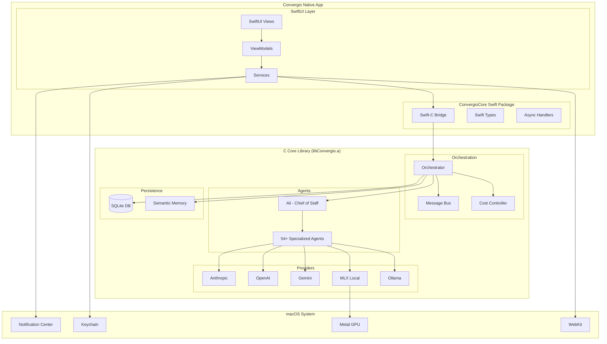
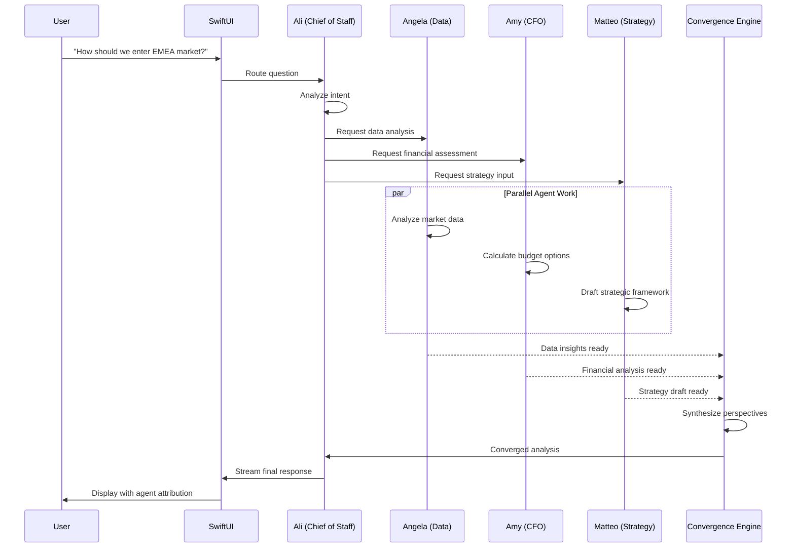
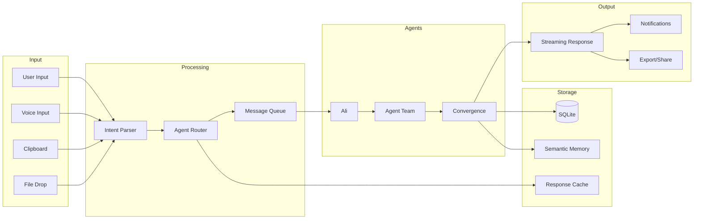
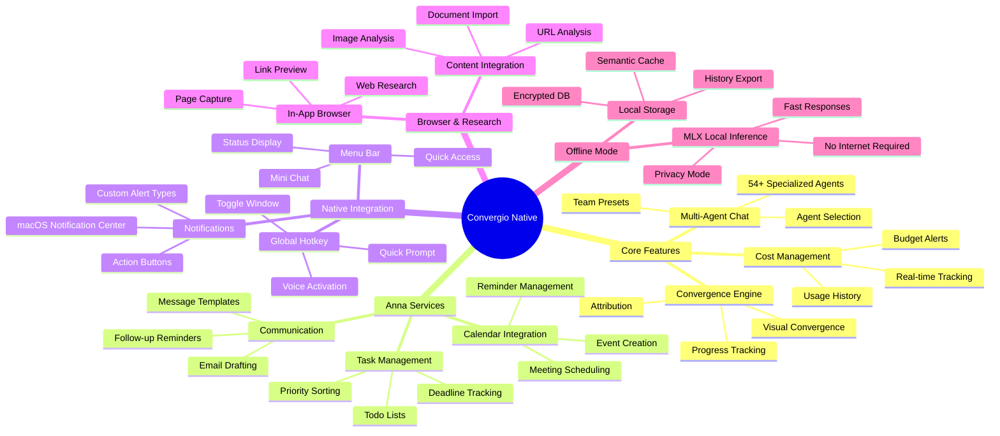
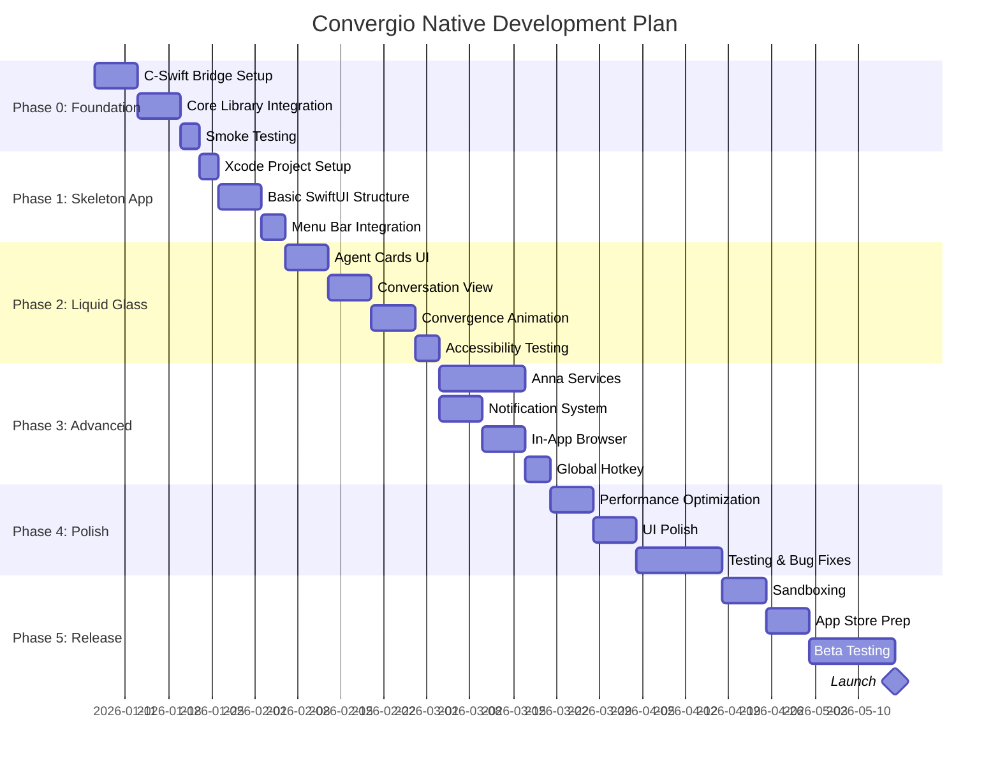
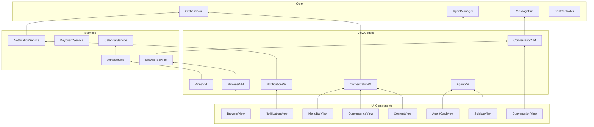
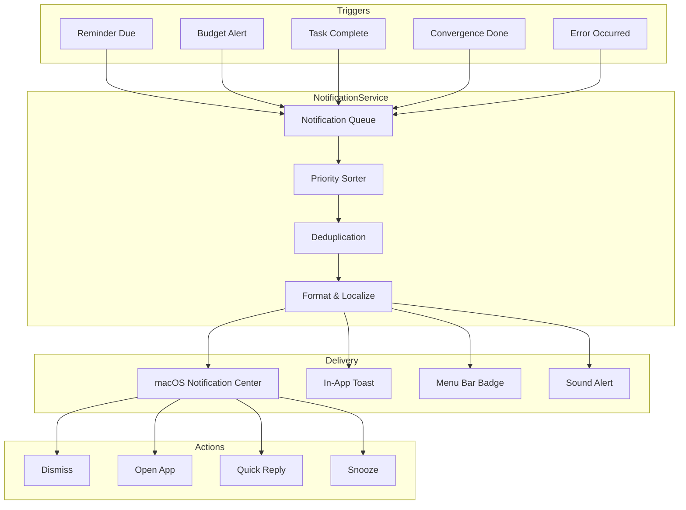

# Convergio Native: Killer App 2026

> **Vision:** Transform Convergio from a powerful CLI into a stunning native macOS application that leverages Apple's new Liquid Glass design language, becoming the definitive AI executive team interface for professionals.

**Created:** 2025-12-14 18:49:29
**Author:** Roberto + AI Team
**Status:** PLANNING PHASE

---

## Table of Contents

1. [Executive Summary](#executive-summary)
2. [Brutally Honest Assessment](#brutally-honest-assessment)
3. [Architecture Diagrams (Mermaid)](#architecture-diagrams-mermaid)
4. [macOS Tahoe 26 & Liquid Glass Deep Dive](#macos-tahoe-26--liquid-glass-deep-dive)
5. [Architecture: Unified Repository Strategy](#architecture-unified-repository-strategy)
6. [Advanced Features: Anna, Notifications, Browser](#advanced-features-anna-notifications-browser)
7. [UI/UX Design Proposals](#uiux-design-proposals)
8. [Technical Implementation Plan](#technical-implementation-plan)
9. [Phase Breakdown & Milestones](#phase-breakdown--milestones)
10. [Risk Matrix & Mitigations](#risk-matrix--mitigations)
11. [Competitive Analysis](#competitive-analysis)
12. [Success Metrics](#success-metrics)

---

## Executive Summary

### The Opportunity

Convergio CLI is **architecturally perfect** for native app conversion:
- Clean separation: 80%+ code reusable as-is
- Already Objective-C integrated (7 .m files)
- Provider abstraction is UI-agnostic
- SQLite persistence works natively

### The Vision

**Convergio Native** will be the first AI executive team application to fully embrace macOS Tahoe 26's Liquid Glass design language, creating an interface where:

- 54+ AI agents appear as **living glass entities** that morph, collaborate, and converge
- The user experience shifts from "typing commands" to "directing a team"
- Professional workflows become **visual, intuitive, and delightful**

### Why Now?

1. **Liquid Glass just launched** (September 2025) - First-mover advantage
2. **No competitor** has a multi-agent orchestration UI on Mac
3. **Apple Intelligence integration** opportunities in macOS 26
4. **CLI market saturated** - GUI is the next frontier

---

## Brutally Honest Assessment

### What Will Work

| Aspect | Confidence | Reason |
|--------|------------|--------|
| Core C library integration | 95% | Swift-C interop is mature; we have working .m bridges |
| Provider abstraction | 100% | Already UI-agnostic by design |
| SQLite persistence | 100% | Native macOS support |
| Multi-agent orchestration | 90% | Message bus architecture translates directly |
| Cost tracking | 100% | Pure business logic, no UI coupling |

### What Will Be Hard

| Challenge | Severity | Why |
|-----------|----------|-----|
| **54 agents visualization** | HIGH | How do you show 54 agents without overwhelming? |
| **Convergence UX** | HIGH | CLI shows linear text; GUI needs spatial representation |
| **Readline replacement** | MEDIUM | Auto-completion system needs SwiftUI reimplementation |
| **Real-time streaming** | MEDIUM | ANSI markdown → native text rendering is non-trivial |
| **Testing** | HIGH | E2E tests are CLI-focused; need complete rewrite |
| **Menu bar + main app** | MEDIUM | Two UI paradigms in one app |

### What Could Kill This Project

1. **Scope creep** - Trying to do everything at once
2. **UX paralysis** - 54 agents is a UX nightmare if not handled carefully
3. **Performance** - SwiftUI + C interop + real-time streaming = potential bottlenecks
4. **Xcode 26 bugs** - Liquid Glass is new; expect framework issues

### Honest Timeline

| Scenario | Duration | Notes |
|----------|----------|-------|
| **MVP (functional)** | 8-10 weeks | Core features, basic UI |
| **Beta (polished)** | 14-16 weeks | Full Liquid Glass, testing |
| **App Store ready** | 20-24 weeks | Sandboxing, notarization, polish |

---

## Architecture Diagrams (Mermaid)

### System Architecture Overview



### Agent Convergence Flow



### Data Flow Architecture



### Feature Map



### Development Timeline (Gantt)



### Component Dependency Graph



### State Machine: Agent Lifecycle

```mermaid
stateDiagram-v2
    [*] --> Idle: App Launch

    Idle --> Selected: User selects agent
    Selected --> Idle: User deselects

    Selected --> Thinking: Query received
    Thinking --> Responding: Analysis complete
    Thinking --> Collaborating: Needs other agents

    Collaborating --> Thinking: Input received
    Collaborating --> Converging: All inputs ready

    Converging --> Responding: Synthesis complete

    Responding --> Idle: Response delivered
    Responding --> Thinking: Follow-up question

    Idle --> [*]: App Quit

    note right of Thinking: Visual: Pulsing ring
    note right of Collaborating: Visual: Connection lines
    note right of Converging: Visual: Move to center
    note right of Responding: Visual: Streaming glow
```

### Notification Flow



---

## macOS Tahoe 26 & Liquid Glass Deep Dive

### What is Liquid Glass?

Apple's most significant design evolution since iOS 7. Key characteristics:

- **Translucent material** with real-time light refraction
- **Dynamic adaptation** to background content
- **Morphing transitions** between UI states
- **Depth hierarchy** - navigation floats above content

### Liquid Glass API Essentials

```swift
// Basic glass effect
Text("Hello, Glass!")
    .padding()
    .glassEffect()

// With customization
Button("Action") { }
    .glassEffect(.regular.tint(.blue).interactive())

// Morphing containers
GlassEffectContainer(spacing: 40) {
    ForEach(agents) { agent in
        AgentBadge(agent)
            .glassEffect()
            .glassEffectID(agent.id, in: namespace)
    }
}
```

### Material Variants

| Variant | Use Case | For Convergio |
|---------|----------|---------------|
| `.regular` | Default UI elements | Agent cards, toolbars, sidebars |
| `.clear` | Media-rich backgrounds | Conversation view, markdown content |
| `.identity` | Conditional disable | Accessibility fallback |

### Design Principles for Convergio

1. **Glass is for navigation, not content** - Agent responses stay solid
2. **Use morphing for state changes** - Agents thinking → converging
3. **Leverage interactive()** - All buttons must respond to touch
4. **Container-based layouts** - GlassEffectContainer for agent groups

---

## Advanced Features: Anna, Notifications, Browser

### Anna - Executive Assistant Services

Anna is the specialized agent that handles executive assistant tasks. In the native app, her capabilities expand significantly with native macOS integration.

#### Calendar Integration

```swift
// Services/CalendarService.swift
import EventKit

@MainActor
class CalendarService: ObservableObject {
    private let eventStore = EKEventStore()
    @Published var hasAccess = false

    func requestAccess() async throws {
        if #available(macOS 14.0, *) {
            hasAccess = try await eventStore.requestFullAccessToEvents()
        } else {
            hasAccess = try await eventStore.requestAccess(to: .event)
        }
    }

    func createMeeting(
        title: String,
        startDate: Date,
        duration: TimeInterval,
        attendees: [String],
        notes: String?
    ) async throws -> EKEvent {
        guard hasAccess else { throw CalendarError.noAccess }

        let event = EKEvent(eventStore: eventStore)
        event.title = title
        event.startDate = startDate
        event.endDate = startDate.addingTimeInterval(duration)
        event.notes = notes
        event.calendar = eventStore.defaultCalendarForNewEvents

        // Add attendees
        event.attendees = attendees.map { email in
            EKParticipant() // Note: Attendees require more complex handling
        }

        try eventStore.save(event, span: .thisEvent)
        return event
    }

    func getUpcomingEvents(days: Int = 7) async throws -> [EKEvent] {
        let startDate = Date()
        let endDate = Calendar.current.date(byAdding: .day, value: days, to: startDate)!

        let predicate = eventStore.predicateForEvents(
            withStart: startDate,
            end: endDate,
            calendars: nil
        )

        return eventStore.events(matching: predicate)
    }
}
```

#### Anna Service Architecture

```swift
// Services/AnnaService.swift
@MainActor
class AnnaService: ObservableObject {
    private let calendarService: CalendarService
    private let reminderService: ReminderService
    private let todoService: TodoService
    private let orchestrator: Orchestrator

    @Published var pendingReminders: [Reminder] = []
    @Published var todaysMeetings: [EKEvent] = []
    @Published var activeTodos: [Todo] = []

    // MARK: - Meeting Management

    func scheduleMeeting(from naturalLanguage: String) async throws -> EKEvent {
        // Use orchestrator to parse natural language
        let parsed = try await orchestrator.parseIntent(naturalLanguage)

        guard case .scheduleMeeting(let details) = parsed else {
            throw AnnaError.invalidIntent
        }

        return try await calendarService.createMeeting(
            title: details.title,
            startDate: details.date,
            duration: details.duration,
            attendees: details.attendees,
            notes: details.notes
        )
    }

    // MARK: - Reminder Management

    func setReminder(
        message: String,
        triggerDate: Date,
        repeating: RepeatInterval? = nil
    ) async throws -> Reminder {
        let reminder = Reminder(
            id: UUID(),
            message: message,
            triggerDate: triggerDate,
            repeating: repeating,
            createdAt: Date()
        )

        try await reminderService.schedule(reminder)
        pendingReminders.append(reminder)

        // Schedule notification
        await NotificationService.shared.scheduleReminder(reminder)

        return reminder
    }

    // MARK: - Todo Management

    func createTodo(
        title: String,
        priority: Priority,
        dueDate: Date?,
        project: String?
    ) async throws -> Todo {
        let todo = Todo(
            id: UUID(),
            title: title,
            priority: priority,
            dueDate: dueDate,
            project: project,
            status: .pending,
            createdAt: Date()
        )

        try await todoService.save(todo)
        activeTodos.append(todo)

        return todo
    }

    // MARK: - Daily Briefing

    func generateDailyBriefing() async throws -> DailyBriefing {
        async let meetings = calendarService.getUpcomingEvents(days: 1)
        async let todos = todoService.getDueTodos(by: Date())
        async let reminders = reminderService.getUpcoming(hours: 24)

        return DailyBriefing(
            date: Date(),
            meetings: try await meetings,
            todos: try await todos,
            reminders: try await reminders
        )
    }
}
```

#### Anna UI Components

```swift
// Views/Anna/AnnaCommandPalette.swift
struct AnnaCommandPalette: View {
    @EnvironmentObject var anna: AnnaService
    @State private var command = ""
    @State private var suggestions: [AnnaSuggestion] = []

    var body: some View {
        VStack(spacing: 0) {
            // Command input
            HStack {
                Image(systemName: "sparkles")
                    .foregroundStyle(.purple)

                TextField("Ask Anna...", text: $command)
                    .textFieldStyle(.plain)
                    .onSubmit { executeCommand() }

                if !command.isEmpty {
                    Button(action: executeCommand) {
                        Image(systemName: "arrow.right.circle.fill")
                    }
                    .buttonStyle(.plain)
                }
            }
            .padding()
            .glassEffect(.regular.tint(.purple.opacity(0.2)))

            // Quick suggestions
            if command.isEmpty {
                VStack(alignment: .leading, spacing: 8) {
                    Text("Quick Actions")
                        .font(.caption)
                        .foregroundStyle(.secondary)
                        .padding(.horizontal)

                    ForEach(AnnaSuggestion.quickActions) { suggestion in
                        Button {
                            command = suggestion.command
                            executeCommand()
                        } label: {
                            HStack {
                                Image(systemName: suggestion.icon)
                                Text(suggestion.title)
                                Spacer()
                            }
                            .padding(.horizontal)
                            .padding(.vertical, 8)
                        }
                        .buttonStyle(.plain)
                    }
                }
                .padding(.vertical)
            }

            // Parsed intent preview
            if let intent = anna.parsedIntent {
                IntentPreviewView(intent: intent)
                    .padding()
                    .glassEffect(.clear)
            }
        }
        .frame(width: 400)
    }

    private func executeCommand() {
        Task {
            try await anna.executeCommand(command)
            command = ""
        }
    }
}

// Quick action suggestions for Anna
struct AnnaSuggestion: Identifiable {
    let id = UUID()
    let icon: String
    let title: String
    let command: String

    static let quickActions: [AnnaSuggestion] = [
        AnnaSuggestion(icon: "calendar.badge.plus", title: "Schedule a meeting", command: "Schedule meeting with "),
        AnnaSuggestion(icon: "bell.badge", title: "Set a reminder", command: "Remind me to "),
        AnnaSuggestion(icon: "checklist", title: "Create a todo", command: "Add todo: "),
        AnnaSuggestion(icon: "sun.horizon", title: "Daily briefing", command: "What's on my agenda today?"),
        AnnaSuggestion(icon: "envelope", title: "Draft an email", command: "Draft email to "),
    ]
}
```

### Notification System

Complete notification management with macOS Notification Center integration.

#### Notification Service

```swift
// Services/NotificationService.swift
import UserNotifications

@MainActor
class NotificationService: ObservableObject {
    static let shared = NotificationService()

    @Published var pendingNotifications: [PendingNotification] = []
    @Published var notificationHistory: [DeliveredNotification] = []

    private let center = UNUserNotificationCenter.current()

    // MARK: - Setup

    func requestAuthorization() async throws -> Bool {
        try await center.requestAuthorization(options: [.alert, .sound, .badge])
    }

    // MARK: - Notification Types

    enum NotificationType: String {
        case reminder = "reminder"
        case budgetAlert = "budget"
        case convergenceComplete = "convergence"
        case agentMessage = "agent"
        case taskComplete = "task"
        case error = "error"

        var categoryIdentifier: String { rawValue }
    }

    // MARK: - Schedule Notifications

    func scheduleReminder(_ reminder: Reminder) async {
        let content = UNMutableNotificationContent()
        content.title = "Reminder from Anna"
        content.body = reminder.message
        content.sound = .default
        content.categoryIdentifier = NotificationType.reminder.categoryIdentifier

        // Add actions
        content.categoryIdentifier = "REMINDER_CATEGORY"

        let trigger = UNCalendarNotificationTrigger(
            dateMatching: Calendar.current.dateComponents(
                [.year, .month, .day, .hour, .minute],
                from: reminder.triggerDate
            ),
            repeats: reminder.repeating != nil
        )

        let request = UNNotificationRequest(
            identifier: reminder.id.uuidString,
            content: content,
            trigger: trigger
        )

        try? await center.add(request)
    }

    func sendBudgetAlert(current: Double, budget: Double) async {
        let percentage = (current / budget) * 100
        let content = UNMutableNotificationContent()
        content.title = "Budget Alert"
        content.body = String(format: "You've used %.0f%% of your budget ($%.2f / $%.2f)", percentage, current, budget)
        content.sound = .default
        content.categoryIdentifier = NotificationType.budgetAlert.categoryIdentifier

        // Immediate delivery
        let request = UNNotificationRequest(
            identifier: UUID().uuidString,
            content: content,
            trigger: nil
        )

        try? await center.add(request)
    }

    func sendConvergenceComplete(agentCount: Int, topic: String) async {
        let content = UNMutableNotificationContent()
        content.title = "Convergence Complete"
        content.body = "\(agentCount) agents have converged on: \(topic)"
        content.sound = .default
        content.categoryIdentifier = NotificationType.convergenceComplete.categoryIdentifier

        // Add "View" action
        content.categoryIdentifier = "CONVERGENCE_CATEGORY"

        let request = UNNotificationRequest(
            identifier: UUID().uuidString,
            content: content,
            trigger: nil
        )

        try? await center.add(request)
    }

    // MARK: - Register Categories with Actions

    func registerCategories() {
        // Reminder actions
        let snoozeAction = UNNotificationAction(
            identifier: "SNOOZE_ACTION",
            title: "Snooze 15 min",
            options: []
        )
        let doneAction = UNNotificationAction(
            identifier: "DONE_ACTION",
            title: "Mark Done",
            options: [.destructive]
        )
        let reminderCategory = UNNotificationCategory(
            identifier: "REMINDER_CATEGORY",
            actions: [snoozeAction, doneAction],
            intentIdentifiers: []
        )

        // Convergence actions
        let viewAction = UNNotificationAction(
            identifier: "VIEW_ACTION",
            title: "View Result",
            options: [.foreground]
        )
        let convergenceCategory = UNNotificationCategory(
            identifier: "CONVERGENCE_CATEGORY",
            actions: [viewAction],
            intentIdentifiers: []
        )

        center.setNotificationCategories([reminderCategory, convergenceCategory])
    }
}
```

#### In-App Toast Notifications

```swift
// Views/Components/ToastView.swift
struct ToastView: View {
    let notification: InAppNotification
    let onDismiss: () -> Void
    let onAction: ((String) -> Void)?

    @State private var isShowing = false

    var body: some View {
        HStack(spacing: 12) {
            // Icon
            Image(systemName: notification.icon)
                .font(.title2)
                .foregroundStyle(notification.iconColor)
                .frame(width: 32)

            // Content
            VStack(alignment: .leading, spacing: 2) {
                Text(notification.title)
                    .font(.headline)

                if let body = notification.body {
                    Text(body)
                        .font(.subheadline)
                        .foregroundStyle(.secondary)
                        .lineLimit(2)
                }
            }

            Spacer()

            // Actions
            if let actions = notification.actions {
                ForEach(actions, id: \.title) { action in
                    Button(action.title) {
                        onAction?(action.identifier)
                    }
                    .buttonStyle(.glass)
                }
            }

            // Dismiss
            Button {
                withAnimation(.easeOut(duration: 0.2)) {
                    isShowing = false
                }
                DispatchQueue.main.asyncAfter(deadline: .now() + 0.2) {
                    onDismiss()
                }
            } label: {
                Image(systemName: "xmark")
                    .foregroundStyle(.secondary)
            }
            .buttonStyle(.plain)
        }
        .padding()
        .glassEffect(.regular.tint(notification.tintColor.opacity(0.2)))
        .frame(maxWidth: 400)
        .opacity(isShowing ? 1 : 0)
        .offset(y: isShowing ? 0 : -20)
        .onAppear {
            withAnimation(.spring(duration: 0.3)) {
                isShowing = true
            }

            // Auto-dismiss after delay
            if notification.autoDismiss {
                DispatchQueue.main.asyncAfter(deadline: .now() + notification.duration) {
                    withAnimation(.easeOut(duration: 0.2)) {
                        isShowing = false
                    }
                    DispatchQueue.main.asyncAfter(deadline: .now() + 0.2) {
                        onDismiss()
                    }
                }
            }
        }
    }
}

// Toast container overlay
struct ToastContainer: View {
    @ObservedObject var notificationManager: InAppNotificationManager

    var body: some View {
        VStack(spacing: 8) {
            ForEach(notificationManager.activeToasts) { toast in
                ToastView(
                    notification: toast,
                    onDismiss: {
                        notificationManager.dismiss(toast)
                    },
                    onAction: { action in
                        notificationManager.handleAction(action, for: toast)
                    }
                )
                .transition(.asymmetric(
                    insertion: .move(edge: .top).combined(with: .opacity),
                    removal: .move(edge: .trailing).combined(with: .opacity)
                ))
            }
        }
        .padding()
        .frame(maxWidth: .infinity, maxHeight: .infinity, alignment: .topTrailing)
    }
}
```

### In-App Browser

WebKit-based browser for research and content integration.

#### Browser Service

```swift
// Services/BrowserService.swift
import WebKit

@MainActor
class BrowserService: NSObject, ObservableObject {
    @Published var currentURL: URL?
    @Published var pageTitle: String = ""
    @Published var isLoading: Bool = false
    @Published var canGoBack: Bool = false
    @Published var canGoForward: Bool = false
    @Published var pageContent: String = ""

    private var webView: WKWebView?

    // MARK: - Configuration

    func createWebView() -> WKWebView {
        let config = WKWebViewConfiguration()

        // Enable JavaScript
        config.defaultWebpagePreferences.allowsContentJavaScript = true

        // User agent
        config.applicationNameForUserAgent = "Convergio/1.0"

        let webView = WKWebView(frame: .zero, configuration: config)
        webView.navigationDelegate = self
        webView.allowsBackForwardNavigationGestures = true

        self.webView = webView
        return webView
    }

    // MARK: - Navigation

    func load(url: URL) {
        webView?.load(URLRequest(url: url))
    }

    func load(urlString: String) {
        guard let url = URL(string: urlString) else { return }

        // Add https if missing
        if url.scheme == nil {
            load(url: URL(string: "https://\(urlString)")!)
        } else {
            load(url: url)
        }
    }

    func goBack() {
        webView?.goBack()
    }

    func goForward() {
        webView?.goForward()
    }

    func reload() {
        webView?.reload()
    }

    func stopLoading() {
        webView?.stopLoading()
    }

    // MARK: - Content Extraction

    func extractPageContent() async throws -> WebPageContent {
        guard let webView = webView else {
            throw BrowserError.noWebView
        }

        // Extract text content via JavaScript
        let textScript = """
            document.body.innerText
        """

        let titleScript = """
            document.title
        """

        let metaScript = """
            JSON.stringify({
                description: document.querySelector('meta[name="description"]')?.content || '',
                keywords: document.querySelector('meta[name="keywords"]')?.content || '',
                author: document.querySelector('meta[name="author"]')?.content || ''
            })
        """

        async let text = webView.evaluateJavaScript(textScript) as? String
        async let title = webView.evaluateJavaScript(titleScript) as? String
        async let metaJSON = webView.evaluateJavaScript(metaScript) as? String

        let meta = try? JSONDecoder().decode(
            PageMeta.self,
            from: (try await metaJSON ?? "{}").data(using: .utf8)!
        )

        return WebPageContent(
            url: currentURL!,
            title: try await title ?? "",
            text: try await text ?? "",
            meta: meta
        )
    }

    // MARK: - Screenshot

    func captureScreenshot() async throws -> NSImage {
        guard let webView = webView else {
            throw BrowserError.noWebView
        }

        let config = WKSnapshotConfiguration()
        return try await webView.takeSnapshot(configuration: config)
    }

    // MARK: - Send to Conversation

    func analyzeCurrentPage(with orchestrator: Orchestrator) async throws {
        let content = try await extractPageContent()

        let prompt = """
        Analyze this web page and provide insights:

        URL: \(content.url)
        Title: \(content.title)

        Content:
        \(content.text.prefix(10000))
        """

        try await orchestrator.send(prompt)
    }
}

extension BrowserService: WKNavigationDelegate {
    func webView(_ webView: WKWebView, didStartProvisionalNavigation navigation: WKNavigation!) {
        isLoading = true
    }

    func webView(_ webView: WKWebView, didFinish navigation: WKNavigation!) {
        isLoading = false
        currentURL = webView.url
        pageTitle = webView.title ?? ""
        canGoBack = webView.canGoBack
        canGoForward = webView.canGoForward
    }

    func webView(_ webView: WKWebView, didFail navigation: WKNavigation!, withError error: Error) {
        isLoading = false
    }
}
```

#### Browser View

```swift
// Views/Browser/BrowserView.swift
import SwiftUI
import WebKit

struct BrowserView: View {
    @StateObject private var browser = BrowserService()
    @EnvironmentObject var orchestrator: Orchestrator
    @State private var urlInput = ""
    @State private var showAnalysis = false

    var body: some View {
        VStack(spacing: 0) {
            // Toolbar
            HStack(spacing: 12) {
                // Navigation buttons
                HStack(spacing: 4) {
                    Button {
                        browser.goBack()
                    } label: {
                        Image(systemName: "chevron.left")
                    }
                    .disabled(!browser.canGoBack)

                    Button {
                        browser.goForward()
                    } label: {
                        Image(systemName: "chevron.right")
                    }
                    .disabled(!browser.canGoForward)

                    Button {
                        browser.reload()
                    } label: {
                        Image(systemName: browser.isLoading ? "xmark" : "arrow.clockwise")
                    }
                }
                .buttonStyle(.plain)

                // URL bar
                HStack {
                    Image(systemName: "globe")
                        .foregroundStyle(.secondary)

                    TextField("Enter URL or search...", text: $urlInput)
                        .textFieldStyle(.plain)
                        .onSubmit {
                            browser.load(urlString: urlInput)
                        }

                    if browser.isLoading {
                        ProgressView()
                            .scaleEffect(0.7)
                    }
                }
                .padding(.horizontal, 12)
                .padding(.vertical, 8)
                .glassEffect(.regular)

                // Actions
                HStack(spacing: 8) {
                    Button {
                        showAnalysis = true
                        Task {
                            try await browser.analyzeCurrentPage(with: orchestrator)
                        }
                    } label: {
                        Image(systemName: "sparkles")
                    }
                    .help("Analyze with AI")

                    Button {
                        Task {
                            if let image = try? await browser.captureScreenshot() {
                                // Copy to clipboard or save
                            }
                        }
                    } label: {
                        Image(systemName: "camera")
                    }
                    .help("Capture screenshot")

                    Button {
                        if let url = browser.currentURL {
                            NSPasteboard.general.clearContents()
                            NSPasteboard.general.setString(url.absoluteString, forType: .string)
                        }
                    } label: {
                        Image(systemName: "doc.on.doc")
                    }
                    .help("Copy URL")
                }
                .buttonStyle(.glass)
            }
            .padding()
            .glassEffect(.regular)

            // WebView
            WebViewRepresentable(browser: browser)
        }
        .onChange(of: browser.currentURL) { _, newURL in
            urlInput = newURL?.absoluteString ?? ""
        }
        .sheet(isPresented: $showAnalysis) {
            AnalysisResultView()
                .environmentObject(orchestrator)
        }
    }
}

// SwiftUI wrapper for WKWebView
struct WebViewRepresentable: NSViewRepresentable {
    @ObservedObject var browser: BrowserService

    func makeNSView(context: Context) -> WKWebView {
        browser.createWebView()
    }

    func updateNSView(_ nsView: WKWebView, context: Context) {
        // Updates handled by browser service
    }
}
```

#### Browser Integration with Conversation

```swift
// Views/Browser/BrowserSplitView.swift
struct BrowserSplitView: View {
    @State private var showBrowser = false
    @StateObject private var browser = BrowserService()

    var body: some View {
        HSplitView {
            // Main conversation
            ConversationView()
                .frame(minWidth: 400)

            // Browser panel (collapsible)
            if showBrowser {
                BrowserView()
                    .frame(minWidth: 400, idealWidth: 500)
                    .transition(.move(edge: .trailing))
            }
        }
        .toolbar {
            ToolbarItem(placement: .automatic) {
                Button {
                    withAnimation(.spring(duration: 0.3)) {
                        showBrowser.toggle()
                    }
                } label: {
                    Image(systemName: showBrowser ? "sidebar.trailing" : "globe")
                }
                .help(showBrowser ? "Hide browser" : "Show browser")
            }
        }
    }
}
```

### Notification Center View

```swift
// Views/Notifications/NotificationCenterView.swift
struct NotificationCenterView: View {
    @ObservedObject var notificationService: NotificationService
    @State private var filter: NotificationFilter = .all

    var body: some View {
        VStack(spacing: 0) {
            // Header
            HStack {
                Text("Notifications")
                    .font(.headline)

                Spacer()

                Picker("Filter", selection: $filter) {
                    Text("All").tag(NotificationFilter.all)
                    Text("Reminders").tag(NotificationFilter.reminders)
                    Text("Alerts").tag(NotificationFilter.alerts)
                    Text("Tasks").tag(NotificationFilter.tasks)
                }
                .pickerStyle(.segmented)
                .frame(width: 200)

                Button("Clear All") {
                    notificationService.clearAll()
                }
                .buttonStyle(.plain)
                .foregroundStyle(.secondary)
            }
            .padding()

            Divider()

            // Notification list
            if filteredNotifications.isEmpty {
                ContentUnavailableView(
                    "No Notifications",
                    systemImage: "bell.slash",
                    description: Text("You're all caught up!")
                )
            } else {
                List(filteredNotifications) { notification in
                    NotificationRow(notification: notification)
                        .swipeActions(edge: .trailing) {
                            Button("Delete", role: .destructive) {
                                notificationService.delete(notification)
                            }
                        }
                        .swipeActions(edge: .leading) {
                            if notification.type == .reminder {
                                Button("Snooze") {
                                    notificationService.snooze(notification, minutes: 15)
                                }
                                .tint(.orange)
                            }
                        }
                }
                .listStyle(.inset)
            }
        }
    }

    private var filteredNotifications: [DeliveredNotification] {
        switch filter {
        case .all:
            return notificationService.notificationHistory
        case .reminders:
            return notificationService.notificationHistory.filter { $0.type == .reminder }
        case .alerts:
            return notificationService.notificationHistory.filter { $0.type == .budgetAlert }
        case .tasks:
            return notificationService.notificationHistory.filter { $0.type == .taskComplete }
        }
    }
}

struct NotificationRow: View {
    let notification: DeliveredNotification

    var body: some View {
        HStack(spacing: 12) {
            // Icon
            Image(systemName: notification.icon)
                .font(.title2)
                .foregroundStyle(notification.iconColor)
                .frame(width: 40, height: 40)
                .glassEffect(.regular.tint(notification.iconColor.opacity(0.2)), in: .circle)

            // Content
            VStack(alignment: .leading, spacing: 4) {
                HStack {
                    Text(notification.title)
                        .font(.headline)

                    Spacer()

                    Text(notification.timestamp, style: .relative)
                        .font(.caption)
                        .foregroundStyle(.secondary)
                }

                if let body = notification.body {
                    Text(body)
                        .font(.subheadline)
                        .foregroundStyle(.secondary)
                        .lineLimit(2)
                }
            }
        }
        .padding(.vertical, 4)
    }
}
```

---

## Architecture: Unified Repository Strategy

### Repository Structure (Proposed)

```
ConvergioCLI/
├── src/                          # Existing C source (UNCHANGED)
│   ├── orchestrator/
│   ├── providers/
│   ├── agents/
│   ├── memory/
│   └── ...
├── include/                      # C headers (UNCHANGED)
├── ConvergioCore/                # NEW: Static library wrapper
│   ├── Package.swift
│   ├── Sources/
│   │   ├── ConvergioCore/        # Swift wrapper for C library
│   │   │   ├── Core.swift        # Main orchestrator interface
│   │   │   ├── Agent.swift       # Agent protocol & types
│   │   │   ├── Provider.swift    # Provider abstraction
│   │   │   └── Message.swift     # Message types
│   │   └── CConvergio/           # C bridging target
│   │       ├── module.modulemap
│   │       └── shim.h
│   └── Tests/
├── ConvergioApp/                 # NEW: SwiftUI application
│   ├── ConvergioApp.xcodeproj
│   ├── ConvergioApp/
│   │   ├── App/
│   │   │   ├── ConvergioApp.swift
│   │   │   └── AppDelegate.swift
│   │   ├── Views/
│   │   │   ├── Main/
│   │   │   │   ├── ContentView.swift
│   │   │   │   ├── SidebarView.swift
│   │   │   │   └── ConversationView.swift
│   │   │   ├── Agents/
│   │   │   │   ├── AgentGridView.swift
│   │   │   │   ├── AgentCardView.swift
│   │   │   │   └── ConvergenceView.swift
│   │   │   ├── MenuBar/
│   │   │   │   ├── MenuBarView.swift
│   │   │   │   └── QuickAccessView.swift
│   │   │   └── Components/
│   │   │       ├── GlassButton.swift
│   │   │       ├── StreamingTextView.swift
│   │   │       └── CostBadge.swift
│   │   ├── ViewModels/
│   │   │   ├── OrchestratorViewModel.swift
│   │   │   ├── AgentViewModel.swift
│   │   │   └── ConversationViewModel.swift
│   │   ├── Services/
│   │   │   ├── NotificationService.swift
│   │   │   └── KeyboardShortcutService.swift
│   │   └── Resources/
│   │       ├── Assets.xcassets
│   │       └── Localizable.strings
│   └── ConvergioAppTests/
├── Makefile                      # Updated: build cli OR app
├── CMakeLists.txt                # Existing (for CLI)
└── README.md
```

### Build Strategy

```makefile
# Makefile additions
.PHONY: cli app core

cli:                              # Existing CLI build
	@mkdir -p build && cd build && cmake .. && make

core:                             # Build libConvergioCore.a
	@cd ConvergioCore && swift build -c release

app:                              # Build native app
	@xcodebuild -project ConvergioApp/ConvergioApp.xcodeproj \
	            -scheme ConvergioApp \
	            -configuration Release \
	            -destination 'platform=macOS'

all: cli core app
```

### C-to-Swift Bridge Design

```swift
// ConvergioCore/Sources/CConvergio/shim.h
#ifndef CONVERGIO_SHIM_H
#define CONVERGIO_SHIM_H

#include "orchestrator.h"
#include "nous.h"
#include "provider.h"
#include "persistence.h"

// Opaque type wrappers for Swift
typedef struct OrchestratorHandle OrchestratorHandle;
OrchestratorHandle* convergio_create(void);
void convergio_destroy(OrchestratorHandle* handle);
int convergio_send_message(OrchestratorHandle* handle, const char* message);
const char* convergio_get_response(OrchestratorHandle* handle);

// Agent enumeration
int convergio_get_agent_count(OrchestratorHandle* handle);
const char* convergio_get_agent_name(OrchestratorHandle* handle, int index);
int convergio_get_agent_state(OrchestratorHandle* handle, int index);

// Cost tracking
double convergio_get_session_cost(OrchestratorHandle* handle);
double convergio_get_budget_remaining(OrchestratorHandle* handle);

#endif
```

```swift
// ConvergioCore/Sources/ConvergioCore/Core.swift
import CConvergio

@MainActor
public final class Orchestrator: ObservableObject {
    private var handle: OpaquePointer?

    @Published public var agents: [Agent] = []
    @Published public var messages: [Message] = []
    @Published public var sessionCost: Double = 0
    @Published public var isProcessing: Bool = false

    public init() {
        handle = convergio_create()
        loadAgents()
    }

    deinit {
        if let h = handle {
            convergio_destroy(h)
        }
    }

    public func send(_ message: String) async throws -> AsyncStream<String> {
        isProcessing = true
        defer { isProcessing = false }

        return AsyncStream { continuation in
            // Callback-based streaming from C
            convergio_send_message_streamed(handle, message) { chunk in
                continuation.yield(String(cString: chunk))
            }
            continuation.finish()
        }
    }
}
```

---

## UI/UX Design Proposals

### Design Philosophy

> "Not a chatbot. A boardroom."

The UI must communicate that Convergio is a **team of specialists**, not a single AI assistant.

### Main Window Layout

```
┌─────────────────────────────────────────────────────────────────────────┐
│ ◉ ◉ ◉                    Convergio                          🔍  👤  ⚙️ │
├──────────────────┬──────────────────────────────────────────────────────┤
│                  │                                                      │
│  🧠 Ali          │  ┌─────────────────────────────────────────────────┐ │
│  Chief of Staff  │  │                                                 │ │
│  ● Active        │  │  "I'll coordinate the team on this analysis.   │ │
│                  │  │   Let me bring in the relevant experts..."     │ │
│  ─────────────── │  │                                                 │ │
│                  │  │  ┌─────────────────────────────────────────┐   │ │
│  📊 Angela       │  │  │        CONVERGENCE IN PROGRESS          │   │ │
│  Data Analyst    │  │  │                                         │   │ │
│  ◐ Thinking...   │  │  │   Angela ──┐                            │   │ │
│                  │  │  │   Matteo ──┼──► Ali ──► Final Response  │   │ │
│  💼 Matteo       │  │  │   Amy ─────┘                            │   │ │
│  Business Arch   │  │  │                                         │   │ │
│  ◐ Thinking...   │  │  │   [Progress: 67%] [Cost: $0.12]         │   │ │
│                  │  │  └─────────────────────────────────────────┘   │ │
│  💰 Amy          │  │                                                 │ │
│  CFO             │  │  ─────────────────────────────────────────────  │ │
│  ◐ Thinking...   │  │                                                 │ │
│                  │  │  [Previous conversation history...]             │ │
│  ─────────────── │  │                                                 │ │
│                  │  └─────────────────────────────────────────────────┘ │
│  + 50 more       │                                                      │
│    agents        │  ┌─────────────────────────────────────────────────┐ │
│                  │  │ Ask the team...                              ⌘↵ │ │
├──────────────────┴──┴─────────────────────────────────────────────────┴─┤
│  Session: 45 min │ Cost: $2.34 / $10.00 │ Model: Claude 3.5 │ MLX: On  │
└─────────────────────────────────────────────────────────────────────────┘
```

### Liquid Glass Components

#### 1. Agent Cards (Sidebar)

```swift
struct AgentCardView: View {
    let agent: Agent
    @Namespace private var namespace

    var body: some View {
        HStack(spacing: 12) {
            // Agent avatar with state indicator
            ZStack {
                Image(systemName: agent.icon)
                    .font(.title2)
                    .foregroundStyle(.white)

                // State ring
                Circle()
                    .stroke(agent.stateColor, lineWidth: 2)
                    .frame(width: 44, height: 44)
            }
            .glassEffect(.regular.interactive(), in: .circle)
            .glassEffectID("avatar-\(agent.id)", in: namespace)

            VStack(alignment: .leading, spacing: 2) {
                Text(agent.name)
                    .font(.headline)
                    .foregroundStyle(.primary)

                Text(agent.role)
                    .font(.caption)
                    .foregroundStyle(.secondary)

                if agent.state == .thinking {
                    ThinkingIndicator()
                }
            }

            Spacer()
        }
        .padding(.horizontal, 12)
        .padding(.vertical, 8)
        .glassEffect(.regular.tint(agent.accentColor.opacity(0.3)))
    }
}
```

#### 2. Convergence Visualization

```swift
struct ConvergenceView: View {
    let activeAgents: [Agent]
    let convergenceProgress: Double
    @Namespace private var convergenceNamespace

    var body: some View {
        GlassEffectContainer(spacing: 20) {
            // Agent bubbles that morph toward center
            ForEach(activeAgents) { agent in
                AgentBubble(agent: agent, progress: convergenceProgress)
                    .glassEffect(.regular.interactive())
                    .glassEffectID("converge-\(agent.id)", in: convergenceNamespace)
                    .offset(bubbleOffset(for: agent, progress: convergenceProgress))
            }

            // Central convergence point
            if convergenceProgress > 0.5 {
                Circle()
                    .fill(.ultraThinMaterial)
                    .frame(width: 80, height: 80)
                    .overlay {
                        Image(systemName: "brain.head.profile")
                            .font(.title)
                            .foregroundStyle(.white)
                    }
                    .glassEffect(.regular.tint(.purple))
                    .glassEffectID("convergence-center", in: convergenceNamespace)
                    .transition(.scale.combined(with: .opacity))
            }
        }
        .animation(.spring(duration: 0.6), value: convergenceProgress)
    }

    private func bubbleOffset(for agent: Agent, progress: Double) -> CGSize {
        // Agents start at edges, converge toward center
        let angle = agent.assignedAngle
        let distance = 150 * (1 - progress) // 150pt at start, 0 at convergence
        return CGSize(
            width: cos(angle) * distance,
            height: sin(angle) * distance
        )
    }
}
```

#### 3. Streaming Response View

```swift
struct StreamingResponseView: View {
    @ObservedObject var viewModel: ConversationViewModel

    var body: some View {
        ScrollViewReader { proxy in
            ScrollView {
                LazyVStack(alignment: .leading, spacing: 16) {
                    ForEach(viewModel.messages) { message in
                        MessageBubble(message: message)
                            .id(message.id)
                    }

                    // Live streaming indicator
                    if viewModel.isStreaming {
                        HStack {
                            TypingIndicator()
                            Text(viewModel.streamingText)
                                .font(.body)
                                .foregroundStyle(.primary)
                        }
                        .padding()
                        .glassEffect(.clear)
                        .id("streaming")
                    }
                }
                .padding()
            }
            .onChange(of: viewModel.messages.count) { _, _ in
                withAnimation {
                    proxy.scrollTo(viewModel.messages.last?.id, anchor: .bottom)
                }
            }
        }
    }
}
```

#### 4. Menu Bar Quick Access

```swift
@main
struct ConvergioApp: App {
    @StateObject private var orchestrator = Orchestrator()

    var body: some Scene {
        // Main window
        WindowGroup {
            ContentView()
                .environmentObject(orchestrator)
        }
        .windowStyle(.hiddenTitleBar)

        // Menu bar presence
        MenuBarExtra("Convergio", systemImage: "brain.head.profile") {
            MenuBarView()
                .environmentObject(orchestrator)
        }
        .menuBarExtraStyle(.window)

        // Settings
        Settings {
            SettingsView()
                .environmentObject(orchestrator)
        }
    }
}

struct MenuBarView: View {
    @EnvironmentObject var orchestrator: Orchestrator
    @State private var quickPrompt: String = ""

    var body: some View {
        VStack(spacing: 16) {
            // Quick prompt field
            TextField("Ask the team...", text: $quickPrompt)
                .textFieldStyle(.plain)
                .padding(12)
                .glassEffect(.regular)
                .onSubmit {
                    Task {
                        await orchestrator.send(quickPrompt)
                        quickPrompt = ""
                    }
                }

            // Active agents
            if !orchestrator.activeAgents.isEmpty {
                VStack(alignment: .leading, spacing: 8) {
                    Text("Active")
                        .font(.caption)
                        .foregroundStyle(.secondary)

                    ForEach(orchestrator.activeAgents.prefix(5)) { agent in
                        HStack {
                            Image(systemName: agent.icon)
                            Text(agent.name)
                            Spacer()
                            StateIndicator(state: agent.state)
                        }
                        .font(.callout)
                    }
                }
                .padding(.horizontal)
            }

            Divider()

            // Quick stats
            HStack {
                Label("$\(orchestrator.sessionCost, specifier: "%.2f")", systemImage: "dollarsign.circle")
                Spacer()
                Label(orchestrator.modelName, systemImage: "cpu")
            }
            .font(.caption)
            .foregroundStyle(.secondary)
            .padding(.horizontal)

            Divider()

            // Actions
            Button("Open Convergio") {
                NSApp.activate(ignoringOtherApps: true)
            }
            .keyboardShortcut("o")

            Button("Quit") {
                NSApp.terminate(nil)
            }
            .keyboardShortcut("q")
        }
        .padding()
        .frame(width: 320)
    }
}
```

#### 5. Global Hotkey Integration

```swift
// Using sindresorhus/KeyboardShortcuts
import KeyboardShortcuts

extension KeyboardShortcuts.Name {
    static let toggleConvergio = Self("toggleConvergio", default: .init(.space, modifiers: [.command, .option]))
    static let newConversation = Self("newConversation", default: .init(.n, modifiers: [.command]))
}

struct HotkeySetup {
    static func register() {
        KeyboardShortcuts.onKeyUp(for: .toggleConvergio) {
            if let window = NSApp.windows.first(where: { $0.title == "Convergio" }) {
                if window.isVisible {
                    window.orderOut(nil)
                } else {
                    window.makeKeyAndOrderFront(nil)
                    NSApp.activate(ignoringOtherApps: true)
                }
            }
        }
    }
}
```

### Agent State Visualizations

| State | Visual | Animation |
|-------|--------|-----------|
| **Idle** | Dim glass, gray ring | None |
| **Thinking** | Bright glass, pulsing ring | Soft pulse (1.5s) |
| **Responding** | Bright glass, streaming glow | Shimmer effect |
| **Collaborating** | Connected lines to other agents | Line drawing animation |
| **Converging** | Moving toward center | Position interpolation |

### Color System (Liquid Glass Compatible)

```swift
extension Color {
    // Agent role colors (translucent-friendly)
    static let agentTechnical = Color(red: 0.2, green: 0.6, blue: 1.0)     // Blue
    static let agentBusiness = Color(red: 1.0, green: 0.6, blue: 0.2)       // Orange
    static let agentCreative = Color(red: 0.8, green: 0.3, blue: 0.8)       // Purple
    static let agentStrategy = Color(red: 0.2, green: 0.8, blue: 0.4)       // Green
    static let agentLeadership = Color(red: 1.0, green: 0.8, blue: 0.2)     // Gold

    // State colors
    static let stateIdle = Color.gray.opacity(0.5)
    static let stateThinking = Color.blue.opacity(0.8)
    static let stateActive = Color.green.opacity(0.8)
    static let stateConverging = Color.purple.opacity(0.8)
}
```

---

## Technical Implementation Plan

### Phase 0: Foundation (Week 1-2)

**Goal:** Establish C-to-Swift bridge and verify core functionality.

#### Tasks:

1. **Create ConvergioCore Swift Package**
   - Set up module.modulemap for C headers
   - Create Swift wrapper types
   - Verify build with `swift build`

2. **Build libConvergioCore.a**
   - Modify CMakeLists.txt to produce static library
   - Test linking with simple Swift test

3. **Smoke Test**
   - Call `convergio_create()` from Swift
   - Send a message, receive response
   - Verify no memory leaks

#### Deliverable:
```swift
// This must work:
let orchestrator = Orchestrator()
let response = await orchestrator.send("Hello")
print(response)
```

### Phase 1: Skeleton App (Week 3-4)

**Goal:** Basic SwiftUI app structure with C library integrated.

#### Tasks:

1. **Create Xcode Project**
   - macOS app target
   - Link ConvergioCore
   - Set up entitlements (network, file access)

2. **Implement Core Views**
   - `ContentView` with NavigationSplitView
   - `SidebarView` with agent list (static mock)
   - `ConversationView` with basic text I/O

3. **Basic State Management**
   - `OrchestratorViewModel` wrapping C library
   - `@Published` properties for agents, messages

4. **Menu Bar Integration**
   - MenuBarExtra with simple view
   - Quit/open commands

#### Deliverable:
- App launches, shows sidebar
- Can send message, receive text response
- Menu bar icon appears

### Phase 2: Liquid Glass UI (Week 5-7)

**Goal:** Full Liquid Glass implementation per Apple guidelines.

#### Tasks:

1. **Agent Cards with Glass**
   - Implement `AgentCardView` with `.glassEffect()`
   - State-based color tinting
   - Interactive responses

2. **Conversation Glass Elements**
   - Glass input field
   - Semi-transparent message bubbles (user)
   - Solid response text (content, not navigation)

3. **GlassEffectContainer Layout**
   - Wrap agent grid in container
   - Implement morphing transitions

4. **Convergence Visualization**
   - Basic version with agent bubbles
   - Animation toward center point

5. **Accessibility Testing**
   - Verify reduced transparency mode
   - Test increased contrast
   - Validate with VoiceOver

#### Deliverable:
- Full Liquid Glass aesthetic
- Morphing agent cards
- Convergence animation (basic)

### Phase 3: Advanced Features (Week 8-10)

**Goal:** Feature parity with CLI + native enhancements.

#### Tasks:

1. **Streaming Responses**
   - Async stream from C callbacks
   - Real-time text rendering
   - Markdown to AttributedString

2. **Agent Detail View**
   - Expandable agent profiles
   - Capability list
   - Recent activity

3. **Cost Dashboard**
   - Real-time cost display
   - Budget progress bar
   - Historical cost chart

4. **Global Hotkey**
   - Integrate KeyboardShortcuts
   - Toggle window visibility
   - Quick prompt from anywhere

5. **Project Support**
   - Project selector
   - Context switching
   - History per project

6. **Native Notifications**
   - Reminder integration
   - Agent completion alerts
   - Budget warnings

#### Deliverable:
- Full feature parity with CLI
- Native macOS integration
- Global hotkey functional

### Phase 4: Polish & Testing (Week 11-14)

**Goal:** Production-ready quality.

#### Tasks:

1. **Performance Optimization**
   - Profile with Instruments
   - Optimize list rendering
   - Memory leak detection

2. **UI Polish**
   - Animation timing refinement
   - Edge case handling
   - Loading states

3. **Testing**
   - Unit tests for ViewModels
   - UI tests for critical flows
   - Integration tests with C library

4. **Error Handling**
   - Network failure states
   - Provider error display
   - Graceful degradation

5. **Documentation**
   - In-app onboarding
   - Keyboard shortcuts help
   - Agent capability reference

#### Deliverable:
- No crashes in 48-hour soak test
- 80%+ test coverage on ViewModels
- Smooth 60fps animations

### Phase 5: App Store Preparation (Week 15-18)

**Goal:** Ready for public release.

#### Tasks:

1. **Sandboxing**
   - Review entitlements
   - Test all features in sandbox
   - Handle file access gracefully

2. **Notarization**
   - Code signing setup
   - Hardened runtime
   - Notarization workflow

3. **App Store Assets**
   - Screenshots (all sizes)
   - App preview video
   - Description copy

4. **Privacy**
   - Privacy policy update
   - App tracking transparency
   - Data usage disclosure

5. **Beta Testing**
   - TestFlight distribution
   - Feedback collection
   - Critical bug fixes

#### Deliverable:
- Notarized DMG for direct distribution
- App Store submission package
- TestFlight beta live

---

## Phase Breakdown & Milestones

```
Week  1-2   [████░░░░░░░░░░░░░░]  Phase 0: Foundation
Week  3-4   [████████░░░░░░░░░░]  Phase 1: Skeleton App
Week  5-7   [████████████░░░░░░]  Phase 2: Liquid Glass
Week  8-10  [████████████████░░]  Phase 3: Advanced Features
Week 11-14  [██████████████████]  Phase 4: Polish
Week 15-18  [██████████████████]  Phase 5: App Store

Milestone 1 (Week 2):  C-Swift bridge working
Milestone 2 (Week 4):  Basic app sending/receiving messages
Milestone 3 (Week 7):  Full Liquid Glass UI
Milestone 4 (Week 10): Feature parity with CLI
Milestone 5 (Week 14): Beta-ready build
Milestone 6 (Week 18): App Store submission
```

---

## Risk Matrix & Mitigations

| Risk | Probability | Impact | Mitigation |
|------|-------------|--------|------------|
| **Liquid Glass bugs in Xcode 26** | HIGH | MEDIUM | Have fallback to standard materials |
| **C-Swift interop complexity** | MEDIUM | HIGH | Start with minimal bridge, expand incrementally |
| **54 agents UX overwhelm** | HIGH | HIGH | Smart grouping, search, "featured" agents |
| **Performance issues** | MEDIUM | HIGH | Profile early, optimize lists first |
| **Scope creep** | HIGH | HIGH | Strict MVP definition, feature backlog |
| **Sandboxing breaks features** | MEDIUM | MEDIUM | Test sandbox early, not at the end |
| **App Store rejection** | LOW | HIGH | Follow guidelines strictly, no private APIs |

### Contingency Plans

1. **If Liquid Glass is too buggy:**
   - Fall back to `.ultraThinMaterial`
   - Still looks modern, just less cutting-edge

2. **If C interop is painful:**
   - Create intermediate Objective-C++ layer
   - Already have .m file experience

3. **If 54 agents is overwhelming:**
   - "Team" groupings (Technical, Business, Creative)
   - AI-suggested agent selection
   - "Quick team" presets

---

## Competitive Analysis

### Current Mac AI Apps

| App | Strengths | Weaknesses | Convergio Advantage |
|-----|-----------|------------|---------------------|
| **ChatGPT Mac** | Simple, reliable | Single agent, no customization | Multi-agent orchestration |
| **Claude Mac** | Clean UI, long context | Single agent | 54 specialized experts |
| **Raycast AI** | Fast, integrated | Limited depth | Deep domain expertise |
| **MacGPT** | Menu bar focus | Basic UI | Native Liquid Glass |

### Convergio's Unique Position

1. **Not a chatbot** - A virtual executive team
2. **Convergence** - Multiple experts synthesize answers
3. **Cost control** - Built-in budget management
4. **Offline capable** - MLX local inference
5. **Professional focus** - Built for serious work

### Target Users

- **Startup founders** - Need CFO, legal, strategy advice
- **Solo consultants** - Augment with virtual team
- **Product managers** - Technical + business perspective
- **Executives** - High-level strategic thinking

---

## Success Metrics

### Launch Targets (Month 1)

| Metric | Target |
|--------|--------|
| Daily Active Users | 500 |
| App Store Rating | 4.5+ |
| Crash-free sessions | 99.5% |
| Average session length | 15+ min |

### Growth Targets (Month 6)

| Metric | Target |
|--------|--------|
| Monthly Active Users | 10,000 |
| Paid conversions (if applicable) | 5% |
| User retention (30-day) | 40% |
| NPS Score | 50+ |

### Quality Gates

- [ ] Zero P0 bugs in production
- [ ] App launch < 2 seconds
- [ ] Memory footprint < 500MB
- [ ] Battery impact: "Low" in Activity Monitor

---

## Appendix A: Liquid Glass Quick Reference

```swift
// Basic usage
view.glassEffect()                              // Default
view.glassEffect(.regular)                      // Explicit regular
view.glassEffect(.clear)                        // More transparent
view.glassEffect(.identity)                     // Disabled

// Customization
view.glassEffect(.regular.tint(.blue))          // Color tint
view.glassEffect(.regular.interactive())        // Responds to touch
view.glassEffect(.regular.tint(.red).interactive())  // Both

// Shapes
view.glassEffect(.regular, in: .capsule)        // Capsule (default)
view.glassEffect(.regular, in: .circle)         // Circle
view.glassEffect(.regular, in: .rect(cornerRadius: 16))  // Rounded rect

// Morphing
view.glassEffectID("myID", in: namespace)       // Enable morphing

// Containers
GlassEffectContainer(spacing: 20) {             // Required for morphing
    // Glass children here
}
```

## Appendix B: Key Dependencies

| Dependency | Purpose | Source |
|------------|---------|--------|
| KeyboardShortcuts | Global hotkeys | github.com/sindresorhus/KeyboardShortcuts |
| MarkdownUI | Markdown rendering | github.com/gonzalezreal/MarkdownUI |
| SQLite.swift | Database access (optional) | github.com/stephencelis/SQLite.swift |

## Appendix C: References

- [macOS Tahoe 26 Features](https://www.macrumors.com/roundup/macos-26/)
- [Liquid Glass Implementation Guide](https://github.com/conorluddy/LiquidGlassReference)
- [Apple HIG](https://developer.apple.com/design/human-interface-guidelines/)
- [WWDC25: Build a SwiftUI app with the new design](https://developer.apple.com/videos/play/wwdc2025/323/)
- [SwiftUI C Library Integration](https://www.swift.org/documentation/articles/wrapping-c-cpp-library-in-swift.html)

---

## Next Steps

1. **Immediate:** Set up ConvergioCore package structure
2. **This week:** Create basic C-Swift bridge and verify
3. **Review:** Schedule design review after Phase 1 completion

---

*"The best interface is the one that disappears, letting you focus on your work, not the tool."*

**Let's build the future of AI-assisted decision making.**
