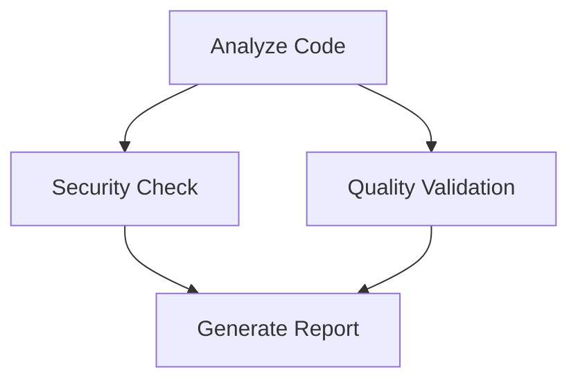

# Workflow Orchestration - User Guide

**Version**: 1.0.0  
**Last Updated**: 2025-12-20

---

## Overview

Convergio's workflow orchestration system enables complex multi-agent coordination through state machine-based workflows. Workflows support checkpointing, conditional routing, and reusable patterns.

---

## Quick Start

### Basic Commands

```bash
# List available workflows
/workflow list

# Show workflow details
/workflow show code-review

# Execute a workflow
/workflow execute parallel-analysis "Analyze this project"

# Resume from checkpoint
/workflow resume 12345
```

---

## CLI Commands

### `/workflow list`

List all available workflows.

**Usage:**
```bash
/workflow list
```

**Output:**
```
Available workflows:
  - code-review.json
  - product-launch.json
```

---

### `/workflow show <name>`

Show detailed information about a workflow, including its structure and Mermaid diagram.

**Usage:**
```bash
/workflow show code-review
```

**Output:**
```
Workflow: Code Review Workflow
Description: Multi-agent code review with analysis, security check, and quality validation
Status: 0
Current node ID: 0

Workflow diagram:

```

---

### `/workflow execute <name> [input]`

Execute a workflow with optional input.

**Usage:**
```bash
/workflow execute code-review "Review this function"
/workflow execute parallel-analysis "Analyze this SaaS project"
```

**Output:**
```
Workflow completed successfully.
[Workflow output here]
```

---

### `/workflow resume <workflow_id> [checkpoint_id]`

Resume a workflow from a checkpoint.

**Usage:**
```bash
/workflow resume 12345
/workflow resume 12345 2
```

**Output:**
```
Restored workflow from checkpoint 2
Workflow resumed successfully.
```

---

## Workflow Patterns

### Review-Refine Loop

Iterative refinement pattern with generator, critic, and refiner agents.

**Use Case:** Content creation, code generation with review cycles

**Example:**
```c
Workflow* wf = pattern_create_review_refine_loop(
    generator_id,
    critic_id,
    refiner_id,
    3  // max iterations
);
```

---

### Parallel Analysis

Multiple analysts work in parallel, then converge results.

**Use Case:** Multi-perspective analysis, comprehensive reviews

**Example:**
```c
SemanticID analysts[] = {analyst1_id, analyst2_id, analyst3_id};
Workflow* wf = pattern_create_parallel_analysis(
    analysts,
    3,
    converger_id
);
```

---

### Sequential Planning

Chain of planners building on each other.

**Use Case:** Multi-phase planning, hierarchical task breakdown

**Example:**
```c
SemanticID planners[] = {planner1_id, planner2_id};
Workflow* wf = pattern_create_sequential_planning(planners, 2);
```

---

### Consensus Building

Multi-agent discussion to reach consensus.

**Use Case:** Decision-making, collaborative design

**Example:**
```c
SemanticID participants[] = {agent1_id, agent2_id, agent3_id};
Workflow* wf = pattern_create_consensus_building(
    participants,
    3,
    0.75  // 75% consensus threshold
);
```

---

## Checkpointing

Workflows automatically create checkpoints at key points. You can resume from any checkpoint.

**Benefits:**
- Resume after crashes
- Debug workflow execution
- Rollback to previous states
- Audit workflow history

---

## Templates

Pre-built workflow templates are available in `src/workflow/templates/`:

- **code-review.json** - Multi-agent code review
- **product-launch.json** - Product launch planning

---

## Advanced Usage

### Programmatic Workflow Creation

```c
// Create workflow
WorkflowNode* entry = workflow_node_create("start", NODE_TYPE_ACTION);
Workflow* wf = workflow_create("my_workflow", "Description", entry);

// Set agent for node
workflow_node_set_agent(entry, agent_id, "Do something");

// Execute
char* output = NULL;
workflow_execute(wf, "input", &output);

// Cleanup
workflow_destroy(wf);
```

### Checkpoint Management

```c
// Create checkpoint
uint64_t checkpoint_id = workflow_checkpoint(wf, "node_name");

// List checkpoints
size_t count = 0;
Checkpoint* checkpoints = workflow_list_checkpoints(wf, &count);

// Restore from checkpoint
workflow_restore_from_checkpoint(wf, checkpoint_id);
```

---

## Troubleshooting

### Workflow Not Found

If a workflow is not found, check:
1. Workflow name is correct
2. Persistence layer is initialized
3. Workflow was saved to database

### Execution Failed

Check:
1. All required agents are available
2. Input is valid
3. Workflow state is correct
4. Check error message: `wf->error_message`

---

## See Also

- [Architecture Analysis](ARCHITECTURE_ANALYSIS.md)
- [Integration Guide](INTEGRATION_GUIDE.md)
- [Master Plan](MASTER_PLAN.md)

